# OmniBioAI Studio

> Desktop orchestration platform for AI-powered bioinformatics computation

**OmniBioAI Studio** is an Electron desktop app that launches and manages the full OmniBioAI stack — locally, on HPC clusters, or in the cloud — with a single click.

---

## ✨ What's New in v0.5.0-beta

- **225+ bioinformatics/ML plugins** — full coverage across scRNA-seq, WGS, WES, proteomics, spatial
- **36M PubMed abstracts indexed** — 150-domain RAG pipeline with PubMedBERT FAISS, BM25 + vector retrieval, RRF reranking, Neo4j knowledge graph
- **1,025 container images** — 225 Docker + 800 ARM64 SIF, migrated to `ghcr.io/omnibioai`
- **600+ workflow bundles** across Nextflow, WDL, CWL, Snakemake
- **Live platform metrics dashboard** — architecture, coverage, and health now publicly viewable at [control.omnibioai.org](https://control.omnibioai.org)

### v0.4.0-beta ✅
- **Version unification** — all UI components, sidebar, badge, logs, and settings now consistently report `v0.4.0-beta`
- **23 services fully operational** — all layers (Data, Security Control Plane, Execution, AI, Developer) green
- **1,010 registered tools** — confirmed live in Jobs → Registered Tools panel *(platform-wide tooling, including HPC/cloud/orchestration integrations, totals 11,000+ — see Bioinformatics Tools section below)*
- **7 execution servers** — `local_real`, `slurm_local`, `aws_batch_prod`, `aws_batch_demo`, `azure_batch_demo`, `gcp_batch_demo`, `enrichment_remote`
- **claude-sonnet-4-20250514** as default orchestrator model in LLM configuration
- **IDE Services all RUNNING** — JupyterLab (:8888), RStudio (:8787), VS Code Server (:8883)
- **Beta Cloud mode** — connects to `app.omnibioai.org`; MySQL, Workbench, TES, Ollama tunnels all reachable
- **Report Bug modal** — title, description, email, severity (Low / Medium / High / Critical) with Submit Bug Report

### v0.3.0-beta ✅
- IDE Services — JupyterLab, RStudio, and VS Code Server managed directly from Studio UI
- IDE Layer — dedicated section on Services page with per-container lifecycle management
- Launcher backend — Express API using Docker socket for IDE container control; ARM64-compatible
- Unified Grafana metrics dashboard embedded in Studio
- Full observability stack: cAdvisor + redis-exporter + django-prometheus
- OmniBioAI dark theme on Grafana and Prometheus
- Auto-generated secrets on first launch via `crypto.randomBytes`
- Grafana service account token auth (anonymous access disabled)
- Zero npm vulnerabilities (Electron 28→41, vite 5→8, all CVEs resolved)
- DMG + AppImage + EXE installers via GitHub Actions
- Public beta announcement + Cloudflare-integrated beta signup

### v0.2.0-beta ✅
- License key system (OMNI-XXXX-XXXX-XXXX-XXXX, 30-day trial)
- Sentry error tracking + in-app bug report button
- Cython IP protection (.so compiled binaries)
- MySQL-backed license server
- 1010+ bioinformatics tools (510 HTTP API + 500 Slurm)
- Windows NSIS .exe installer
- Zero-trust JWT authentication, RBAC/ABAC policy engine
- HPC quota governance + async audit logging via Redis Streams

### v0.1.0-beta ✅
- Full local stack launch with containerized services
- Live service health monitoring
- Docker image dashboard
- Dev Hub with knowledge graph + RAG UI
- Mode-aware startup: Local / HPC / Cloud / Hybrid
- LLM configuration: Ollama + Claude API + OpenAI
- Cloud execution: AWS Batch / Azure Batch / GCP Batch / Kubernetes
- HPC execution: Slurm / PBS / LSF via TES

---

## 🖥 Screenshots

### Runtime Mode — Service Health
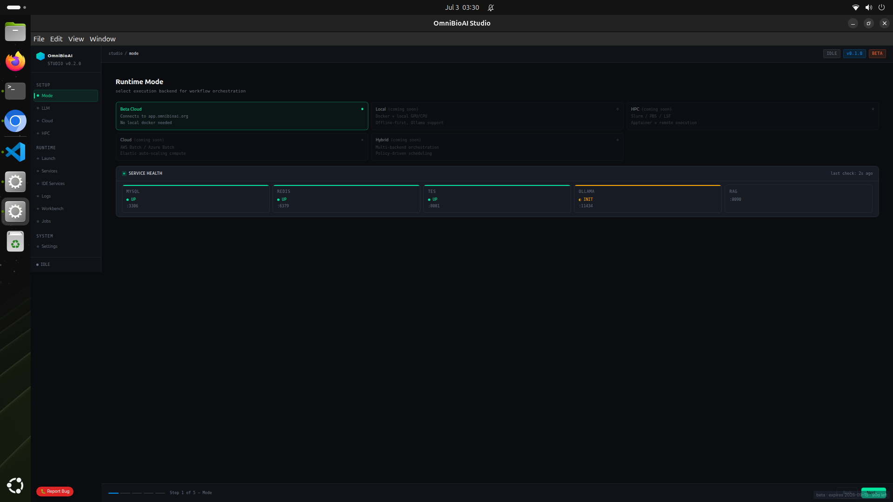
*Beta Cloud selected — MySQL, Redis, TES, Workbench UP; Ollama initializing*

### Workbench — Module Overview
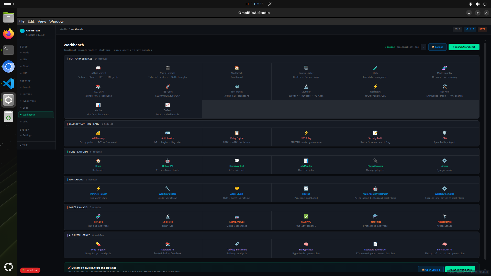
*Quick access to all 44 modules across 6 sections*

### LLM Configuration
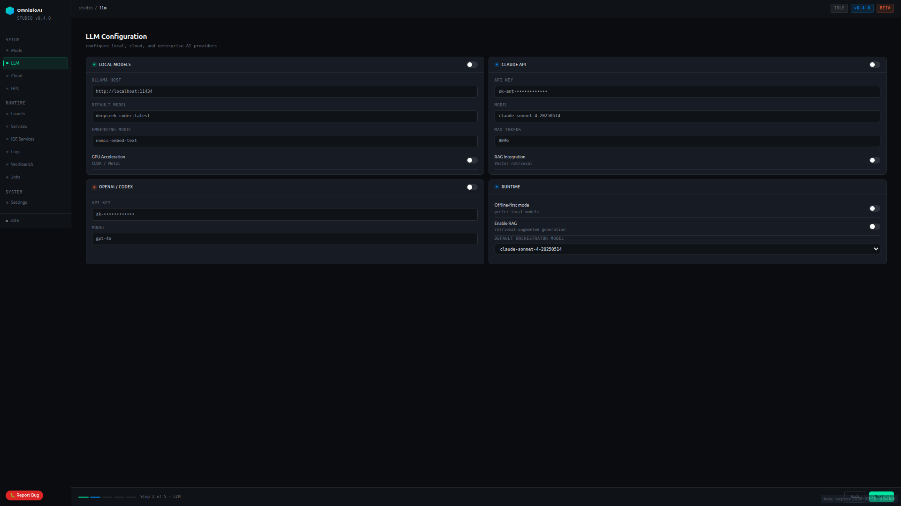
*Local Ollama (deepseek-coder), Claude API, OpenAI/Codex, and runtime orchestration settings*

### Cloud Configuration
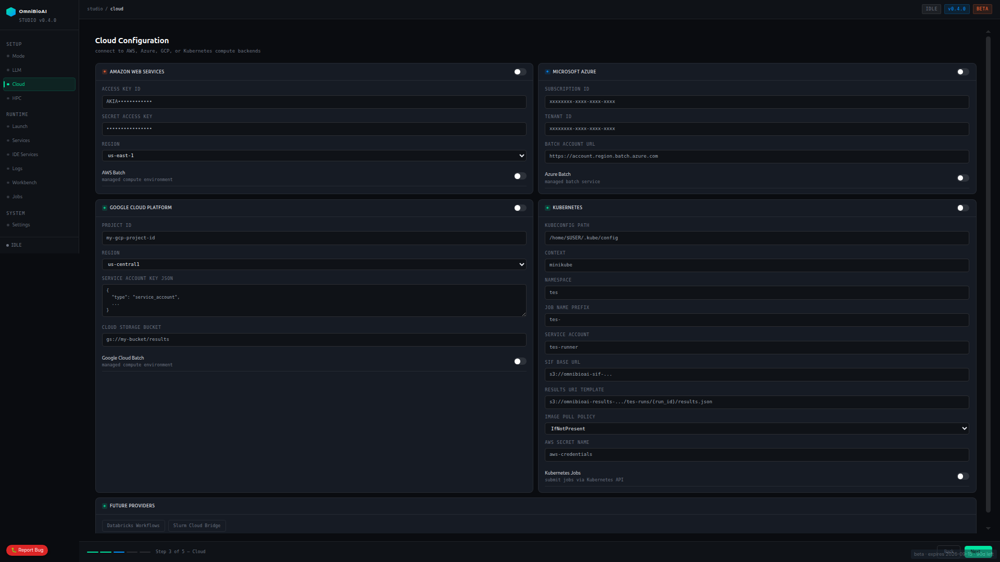
*AWS, Azure, GCP, and Kubernetes execution backends with full credential management*

### HPC Configuration
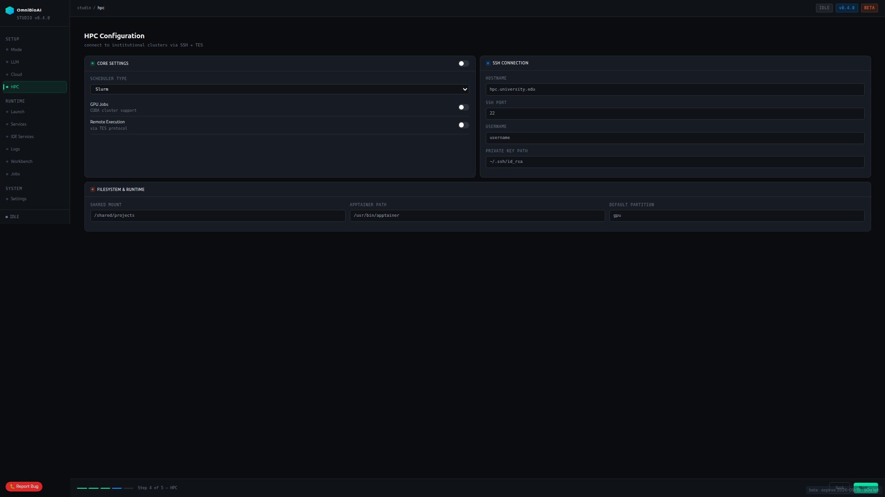
*Slurm scheduler, SSH connection, GPU jobs, TES remote execution, filesystem & runtime settings*

### Launch — Execution Console
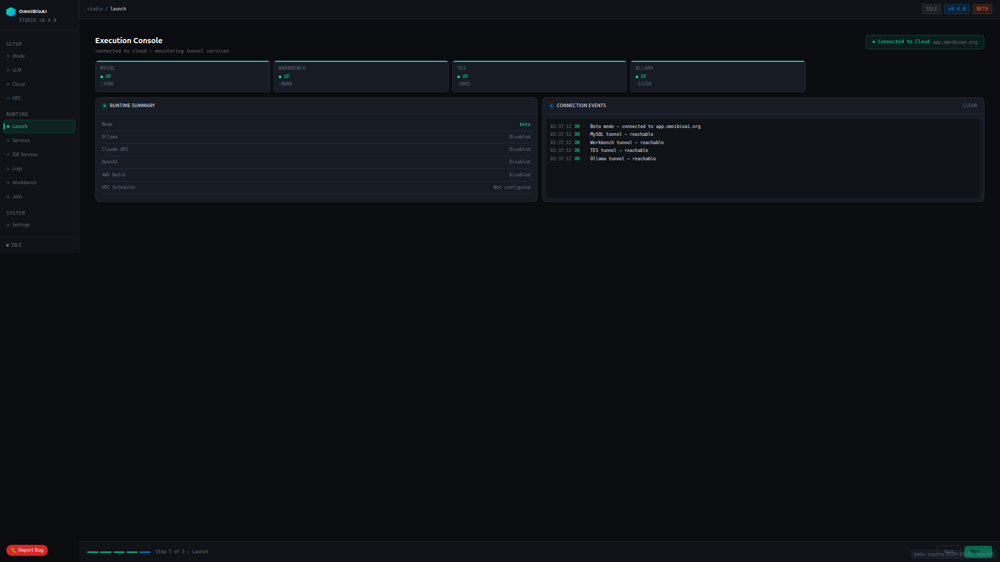
*Connected to Beta Cloud — all tunnels reachable, runtime summary visible*

### Services — Full Stack
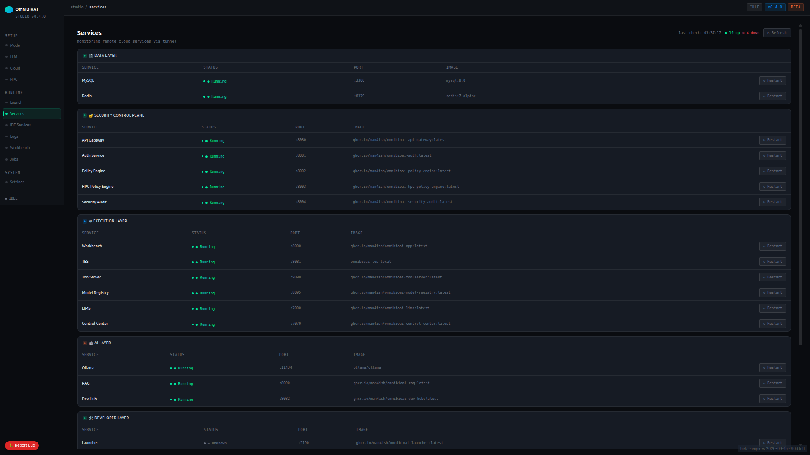
*23 services across Data, Security Control Plane, Execution, AI, and Developer layers*

### IDE Services
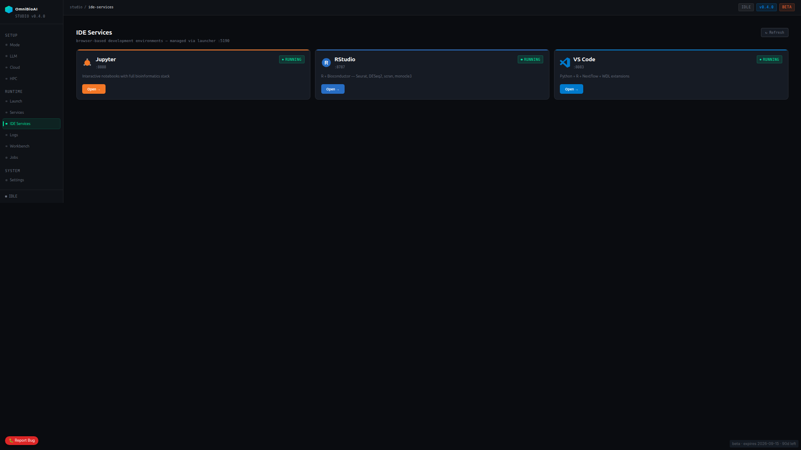
*JupyterLab, RStudio, VS Code Server — all RUNNING, managed via Launcher :5190*

### Live Logs
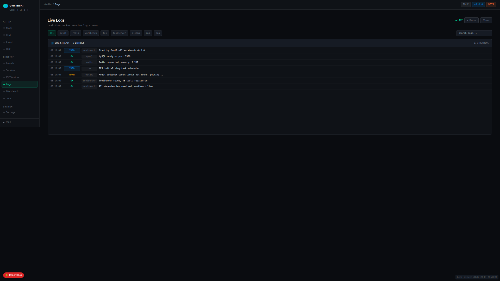
*Real-time log stream — 7 entries, filterable by service, live streaming*

### Jobs — TES Execution Engine
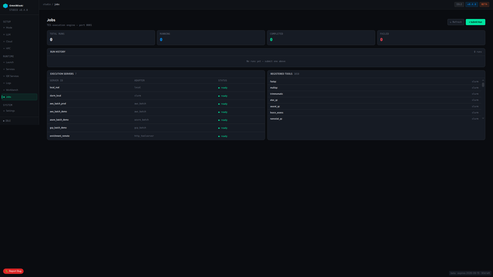
*1,010 registered tools · 7 execution servers (local, Slurm, AWS, Azure, GCP, enrichment_remote)*

### Settings
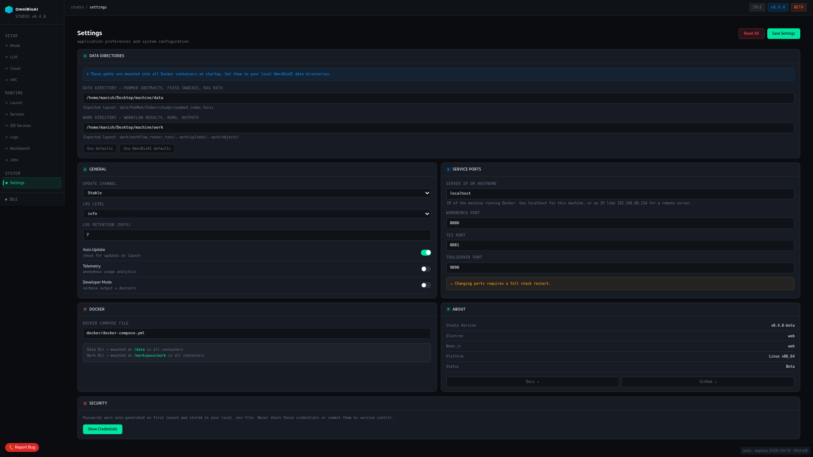
*Data directories, service ports, Docker compose file, security, About panel*

### Bug Report
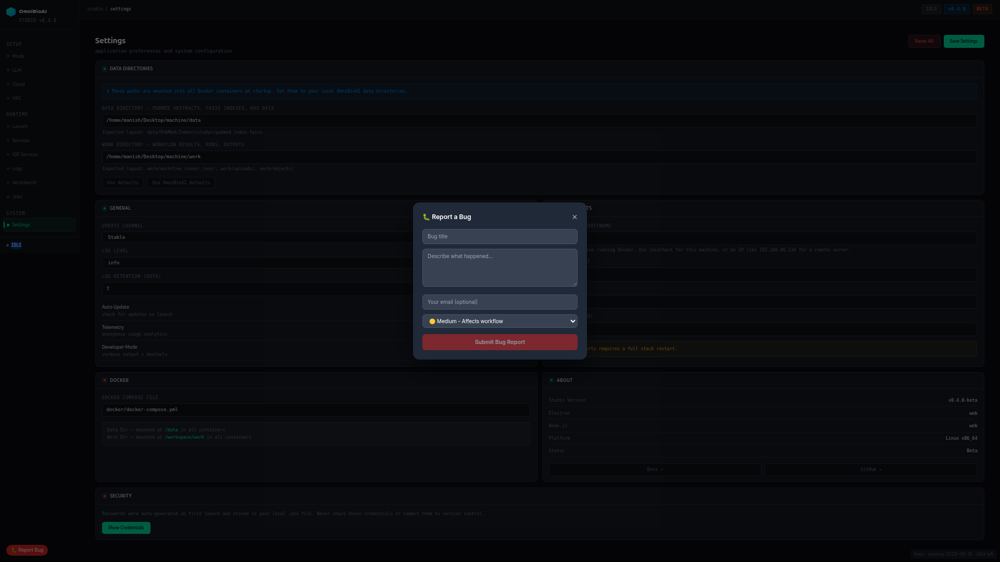
*In-app bug reporting with title, description, email, and severity selector*

---

## 📦 Downloads

| Platform | File | Requirements |
|----------|------|--------------|
| macOS Apple Silicon (M1/M2/M3/M4) | `OmniBioAI-Studio-arm64.dmg` | macOS 12+ |
| macOS Intel | `OmniBioAI-Studio-x64.dmg` | macOS 12+ |
| Linux x86_64 AppImage | `OmniBioAI-Studio.AppImage` | Ubuntu 20.04+ |
| Linux x86_64 DEB | `OmniBioAI-Studio.deb` | Ubuntu / Debian |
| Linux x86_64 RPM | `OmniBioAI-Studio.rpm` | RHEL / Fedora |
| Linux ARM64 AppImage | `OmniBioAI-Studio-arm64.AppImage` | aarch64, Ubuntu 20.04+ |
| Linux ARM64 DEB | `OmniBioAI-Studio-arm64.deb` | Ubuntu / Debian ARM64 |
| Linux ARM64 RPM | `OmniBioAI-Studio-arm64.rpm` | RHEL / Fedora ARM64 |
| Windows | `OmniBioAI-Studio-Setup.exe` | Windows 10/11 + WSL2 |

Download from: https://github.com/OmniBioAI/omnibioai-studio/releases/latest

---

## 📊 Live Platform Proof

Real-time architecture, codebase metrics, coverage, and service health are publicly viewable at:

**[control.omnibioai.org](https://control.omnibioai.org)**

---

## 🔐 Security Control Plane

All requests are enforced through a zero-trust pipeline:

```
Internet / Client
       ↓
api-gateway :8080       ← single entry point, JWT enforcement
       ↓
auth-service :8001      ← JWT validation + Redis cache (TTL=300s)
       ↓
policy-engine :8002     ← RBAC/ABAC authorization decision
       ↓
hpc-policy-engine :8003 ← GPU/CPU quota check (compute requests only)
       ↓
target service (workbench / tes / toolserver / rag)
       ↓
security-audit :8004    ← async audit log → Redis Streams (never blocks)
```

| Layer | On failure |
|-------|------------|
| Auth | FAIL CLOSED → HTTP 401 |
| Policy | FAIL CLOSED → HTTP 403 |
| HPC quota | FAIL CLOSED → HTTP 403 |
| Audit | FAIL OPEN → ignored |

---

## 🖥 Services

### Data Layer
| Service | Port | Image |
|---------|------|-------|
| MySQL | :3306 | mysql:8.0 |
| Redis | :6379 (mapped :6380 on host) | redis:7-alpine |

### Security Control Plane
| Service | Port | Image |
|---------|------|-------|
| API Gateway | :8080 | ghcr.io/omnibioai/omnibioai-api-gateway:latest |
| Auth Service | :8001 | ghcr.io/omnibioai/omnibioai-auth:latest |
| Policy Engine | :8002 | ghcr.io/omnibioai/omnibioai-policy-engine:latest |
| HPC Policy Engine | :8003 | ghcr.io/omnibioai/omnibioai-hpc-policy-engine:latest |
| Security Audit | :8004 | ghcr.io/omnibioai/omnibioai-security-audit:latest |

### Execution Layer
| Service | Port | Image |
|---------|------|-------|
| Workbench | :8000 | ghcr.io/omnibioai/omnibioai-app:latest |
| TES | :8081 | omnibioai-tes-local |
| ToolServer | :9090 | ghcr.io/omnibioai/omnibioai-toolserver:latest |
| Model Registry | :8095 | ghcr.io/omnibioai/omnibioai-model-registry:latest |
| LIMS | :7000 | ghcr.io/omnibioai/omnibioai-lims:latest |
| Control Center | :7070 (localhost-only, JWT-gated via nginx `/_svc/control`) | ghcr.io/omnibioai/omnibioai-control-center:latest |
| Workflow Bundles | :8098 | ghcr.io/omnibioai/omnibioai-workflow-bundles:latest |
| Tool Images | :8097 | ghcr.io/omnibioai/omnibioai-tool-images:latest |

### AI Layer
| Service | Port | Image |
|---------|------|-------|
| Ollama | :11434 | ollama/ollama |
| RAG | :8090 (external) / :8096 (internal) | ghcr.io/omnibioai/omnibioai-rag:latest |
| Dev Hub | :8082 | ghcr.io/omnibioai/omnibioai-dev-hub:latest |
| Neo4j | :7474 / :7687 | neo4j:5.15 |

### Developer Layer
| Service | Port | Image |
|---------|------|-------|
| Launcher | :5190 | ghcr.io/omnibioai/omnibioai-launcher:latest |

### IDE Services (managed via Launcher :5190)
| Service | Port | Stack |
|---------|------|-------|
| JupyterLab | :8888 | Full bioinformatics stack (scanpy, DESeq2, scVelo, cellxgene…) |
| RStudio Server | :8787 | R + Bioconductor (Seurat, DESeq2, scran, monocle3, tidyverse) |
| VS Code Server | :8883 | Python + R + Nextflow + WDL extensions |

### Observability & Platform Infrastructure
| Service | Port | Image |
|---------|------|-------|
| Grafana | :3000 | grafana/grafana:latest |
| Prometheus | internal only, via `/_svc/prometheus` | prom/prometheus:latest |
| cAdvisor | :8585 | gcr.io/cadvisor/cadvisor:latest |
| Redis Exporter | :9121 | oliver006/redis_exporter:latest |
| License Server | :8099 | internal build |
| OPA (Open Policy Agent) | :8181 | openpolicyagent/opa:latest |
| Videos | :8086 | ghcr.io/omnibioai/omnibioai-videos:latest |
| Nginx Router | :80 | nginx:latest |

---

## 🧰 Bioinformatics Tools (11,000+)

**1,010 tools** are actively registered and runnable today (confirmed live in Jobs → Registered Tools panel). The broader platform catalog — including all execution, cloud, HPC, and orchestration tooling across every service — totals **11,000+**.

### Execution Servers (7)
| Server ID | Adapter |
|-----------|---------|
| local_real | local |
| slurm_local | slurm |
| aws_batch_prod | aws_batch |
| aws_batch_demo | aws_batch |
| azure_batch_demo | azure_batch |
| gcp_batch_demo | gcp_batch |
| enrichment_remote | http_toolserver |

### HTTP API Tools (510)
Direct REST integrations — no compute needed: Ensembl, NCBI, ClinVar, gnomAD, UniProt, AlphaFold, KEGG, Reactome, PubMed, ChEMBL, DrugBank, CellxGene, HMDB, and 280+ more.

### Slurm/HPC Tools (500)
Compute tools: BWA, STAR, HISAT2, GATK, DeepVariant, DESeq2, Seurat, Scanpy, PyTorch, MSFragger, and 90+ more.

---

## 🧬 Workbench Modules (44 total)

### Platform Services (14 modules)
Getting Started · Video Tutorials · Workbench Dashboard · Control Center · LIMS · Model Registry · RAG/Lit AI · TES/Jobs · Tool Images · Launcher · Workflows · Dev Hub · Metrics · Grafana

### Security Control Plane (6 modules)
API Gateway · Auth Service · Policy Engine · HPC Policy · Security Audit · OPA

### Core Platform (6 modules)
Home · OnboardAI · Omni Assistant · Job Monitor · Plugin Manager · Admin

### Workflows (6 modules)
Workflow Runner · Workflow Builder · Agent Studio · Pipeline Dashboard · Multi-Agent Orchestrator · Workflow Compiler

### Omics Analysis (6 modules)
RNA-Seq · Single Cell (scRNA-Seq) · Exome Analysis · FASTQ QC · Proteomics · Metabolomics

### AI & Intelligence (6 modules)
Drug Target AI · Literature AI · Pathway Enrichment · Bio Hypothesis · Literature Summarizer · Bio Narrator AI

---

## 🖥 Runtime Modes

| Mode | Status | Description |
|------|--------|--------------|
| **Beta Cloud** | ✅ Available | Connects to `app.omnibioai.org` — no local Docker needed |
| Local | Coming soon | Docker + local GPU/CPU, offline-first, Slurm support |
| HPC | Coming soon | Slurm / PBS / LSF, Apptainer remote execution |
| Cloud | Coming soon | AWS Batch / Azure Batch, elastic auto-scaling |
| Hybrid | Coming soon | Multi-backend orchestration, policy-driven scheduling |

---

## 🤖 LLM Configuration

| Provider | Model | Notes |
|----------|-------|-------|
| Ollama (local) | deepseek-coder:latest | Default local model; GPU-accelerated |
| Embedding | nomic-embed-text | Local embedding model |
| Claude API | claude-sonnet-4-20250514 | Default orchestrator model |
| OpenAI / Codex | gpt-4o | Optional cloud fallback |

Runtime options: Offline-first mode, Enable RAG (vector retrieval), Default Orchestrator Model selector.

---

## ☁️ Cloud Configuration

| Provider | Features |
|----------|----------|
| Amazon Web Services | AWS Batch, IAM access keys, S3, region selector |
| Microsoft Azure | Azure Batch, subscription ID, tenant ID, Blob storage |
| Google Cloud Platform | GCP Batch, project ID, service account JSON, Cloud Storage |
| Kubernetes | kubeconfig path, context, namespace, SIF base URL, job prefix |
| Future: Databricks Workflows | — |
| Future: Slurm Cloud Bridge | — |

---

## 🏗 HPC Configuration

| Setting | Value |
|---------|-------|
| Scheduler | Slurm (dropdown: Slurm / PBS / LSF) |
| GPU Jobs | CUDA cluster support |
| Remote Execution | via TES protocol |
| SSH Hostname | hpc.university.edu (configurable) |
| SSH Port | 22 |
| Private Key | ~/.ssh/id_rsa |
| Shared Mount | /shared/projects |
| Apptainer Path | /usr/bin/apptainer |
| Default Partition | gpu |

---

## 📊 Observability

### Grafana Dashboards (4)
- OmniBioAI Services — health, request rate, latency, container resources
- OmniBioAI Platform Overview — full platform architecture metrics
- OmniBioAI LIMS — lab information management metrics
- OmniBioAI RAG — query latency and throughput

### Prometheus Scrape Targets (7)
workbench:8000 · lims:7000 · rag:8096 · auth-service:8001 · control-center:7070 · cadvisor:8080 · redis-exporter:9121

---

## 📋 System Requirements

| Component | Minimum | Recommended |
|-----------|---------|--------------|
| RAM | 16 GB | 32 GB (64 GB with local LLM) |
| Disk | 50 GB free | 100 GB free |
| Docker | Engine 24+ | Docker Desktop |
| OS | Ubuntu 20.04+, macOS 12+, Windows 10/11 (WSL2) | Ubuntu 22.04+ |
| GPU | Optional | NVIDIA + nvidia-container-toolkit |

Also required: `jq` (`sudo apt install jq`), Docker Compose v2 (included with Engine 24+)

---

## 🚀 Quick Start

### Beta Cloud (no Docker needed)

1. Download installer for your platform from [Releases](https://github.com/OmniBioAI/omnibioai-studio/releases/latest)
2. Launch OmniBioAI Studio and enter your license key
3. Select **Beta Cloud** on the Mode page
4. Click through the setup wizard (Steps 1–5)
5. Click **Launch** — tunnels connect to `app.omnibioai.org` automatically

### Local Stack (Docker)

```bash
git clone https://github.com/OmniBioAI/omnibioai-studio
cd omnibioai-studio
cp .env.example .env
# Edit .env — set DATA_DIR, WORK_DIR, and secrets
docker compose up -d
```

### From Source

```bash
npm install
npm run dev          # development mode (Vite + Electron)
npm run build        # AppImage (Linux)
npm run build:mac    # DMG (macOS)
npm run build:win    # EXE (Windows)
```

---

## ⚙️ Settings

### Data Directories
| Path | Purpose |
|------|---------|
| Data Directory | PubMed abstracts, FAISS indexes, RAG data |
| Work Directory | Workflow results, runs, outputs |

Expected layout:
- `data/PubMed/Index/<study>/pubmed_index.faiss`
- `work/workflow_runner.runs/`, `work/uploads/`, `work/objects/`

### Service Ports (configurable)
| Service | Default Port |
|---------|---------------|
| Workbench | 8000 |
| TES | 8081 |
| ToolServer | 9090 |

> Changing ports requires a full stack restart.

### Docker
- Compose file: `docker/docker-compose.yml`
- Data Dir mounted as `/data` in all containers
- Work Dir mounted as `/workspace/work` in all containers

### About (v0.5.0-beta)
| Field | Value |
|-------|-------|
| Studio Version | v0.5.0-beta |
| Electron | web |
| Node.js | web |
| Platform | Linux x86_64 |
| Status | Beta |

---

## 🔑 License

OmniBioAI Studio requires a license key for first launch.

- **Format:** `OMNI-XXXX-XXXX-XXXX-XXXX` (30-day trial)
- **Get access:** [omnibioai.org/#request](https://omnibioai.org/#request)
- **Offline grace period:** 7 days after initial validation
- Beta users receive a GitHub token automatically with their license key

---

## 🔑 Environment Variables

```bash
# Database
MYSQL_ROOT_PASSWORD=your-db-password
MYSQL_DEFAULT_DB=omnibioai

# Auth
AUTH_SECRET_KEY=your-secret-key-here

# Paths (absolute paths on host)
DATA_DIR=/path/to/data
WORK_DIR=/path/to/work
WORKSPACE_HOST=/path/to/workspace
DB_INIT_DIR=/path/to/omnibioai-studio/db-init

# AI API Keys (optional)
ANTHROPIC_API_KEY=
OPENAI_API_KEY=

# IDE Services
JUPYTER_TOKEN=devtoken
RSTUDIO_PASSWORD=change-me
VSCODE_PASSWORD=change-me

# Observability
SENTRY_DSN=

# Build
DEV_MODE=false
```

---

## 🐛 Bug Reporting

Click the 🐛 **Report Bug** button in the Studio UI at any time.

Fields: Bug title · Description · Email (optional) · Severity (Low / Medium — Affects workflow / High / Critical)

Reports are sent to our dashboard. Response within 24 hours during beta. Disable with `SENTRY_DSN=` (empty) in `.env`.

---

## 🔗 OmniBioAI Ecosystem

| Repository | Role |
|------------|------|
| `omnibioai` | Main Django workbench + 80+ plugins |
| `omnibioai-api-gateway` | Zero-trust API gateway |
| `omnibioai-auth` | JWT authentication service |
| `omnibioai-policy-engine` | RBAC/ABAC authorization |
| `omnibioai-hpc-policy-engine` | GPU/CPU quota governance |
| `omnibioai-security-audit` | Async audit logging |
| `omnibioai-tes` | Task Execution Service |
| `omnibioai-toolserver` | FastAPI tool API |
| `omnibioai-lims` | Lab data management |
| `omnibioai-model-registry` | ML model versioning |
| `omnibioai-control-center` | Health + image dashboard |
| `omnibioai-rag` | PubMed RAG pipeline |
| `omnibioai-dev-hub` | Knowledge graph + embeddings |
| `omnibioai-workflow-bundles` | WDL/Nextflow/Snakemake bundles |
| `omnibioai-launcher` | SDK UI + IDE container lifecycle API |
| `omnibioai_sdk` | Python SDK client |
| `omnibioai-security-sdk` | Security SDK for service auth |
| `omnibioai-design-tokens` | Shared design tokens and theme |
| `omnibioai-ui` | Shared UI component library |
| `omnibioai-landing` | Public-facing landing page |

---

## 🗺 Roadmap

| Version | Status | Highlights |
|---------|--------|-------------|
| v0.1.0-beta | ✅ Released | Local stack, health monitoring, Dev Hub, LLM config |
| v0.2.0-beta | ✅ Released | License system, zero-trust security, 1,010 tools, Windows installer |
| v0.3.0-beta | ✅ Released | IDE Services, Grafana observability, auto-secrets, npm security |
| v0.4.0-beta | ✅ Released | Version unification, 23 services, 7 exec servers, claude-sonnet-4 |
| **v0.5.0-beta** | ✅ **Current** | 225+ plugins, 36M-abstract RAG index, 1,025 container images, full beta launch |
| v0.6.0 | 🔜 Planned | SSO/SAML, role management UI, HIPAA compliance reporting |

---

## 🐛 Known Issues (Beta)

- System MySQL/Redis must be stopped before starting: `sudo systemctl stop mysql redis-server`
- `GITHUB_TOKEN` must be set manually for private image pull
- macOS DMG not yet code-signed (GateKeeper warning expected)
- Windows installer not yet code-signed
- First launch requires internet for license validation; 7-day offline grace period after
- cAdvisor requires privileged mode and `/dev/kmsg` device access
- Prometheus not exposed directly — access only via `/_svc/prometheus`
- Control Center (`/_svc/control`) requires valid JWT; port 7070 bound to localhost only

---

## 🛠 Maintenance Scripts

| Script | Description | Schedule |
|--------|--------------|----------|
| `scripts/backup-mysql.sh` | Dumps all DBs to compressed `.sql.gz`, 7-day rotation | Daily at 4am |
| `scripts/check-env.sh` | Validates `.env` secrets before stack start | Before `docker compose up` |
| `omnibioai-control-center/scripts/run_coverage_host.py` | Rebuilds ecosystem coverage report | Daily at 2am |
| `omnibioai-dev-hub/scripts/check_and_reindex.sh` | Rebuilds RAG FAISS index on new Studio release | Hourly (checks for new release tag) |

```cron
0 4 * * * /home/manish/Desktop/machine/omnibioai-studio/scripts/backup-mysql.sh >> /home/manish/Desktop/machine/work/backups/omnibioai-backup.log 2>&1
0 2 * * * python3 /home/manish/Desktop/machine/omnibioai-control-center/scripts/run_coverage_host.py --root /home/manish/Desktop/machine >> /home/manish/Desktop/machine/work/backups/omnibioai-coverage.log 2>&1
0 * * * * /home/manish/Desktop/machine/omnibioai-dev-hub/scripts/check_and_reindex.sh >> /home/manish/Desktop/machine/work/backups/omnibioai-reindex.log 2>&1
```

---

## 📄 License

Apache 2.0 — see [LICENSE](LICENSE)

---

## 👤 Author

Manish Kumar — [GitHub](https://github.com/man4ish) · [omnibioai.org](https://omnibioai.org)

---

*OmniBioAI Studio is not a bioinformatics tool — it is a desktop orchestration system for distributed, secure, AI-native scientific computation.*