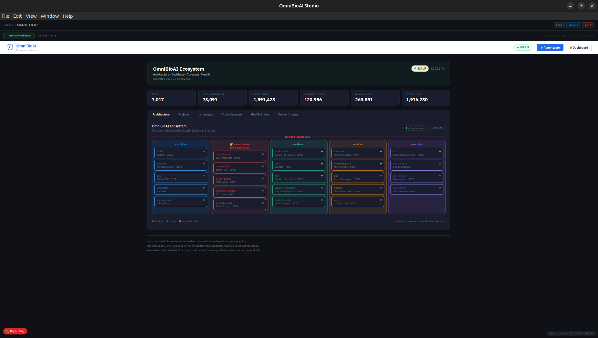
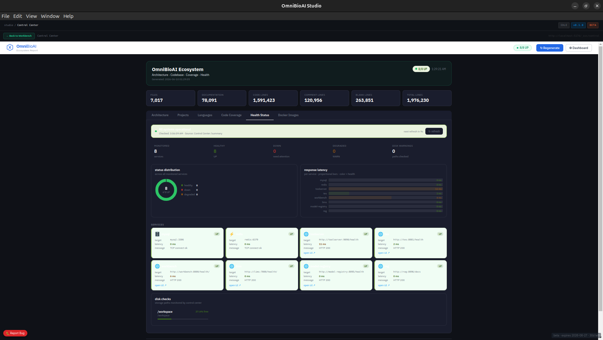
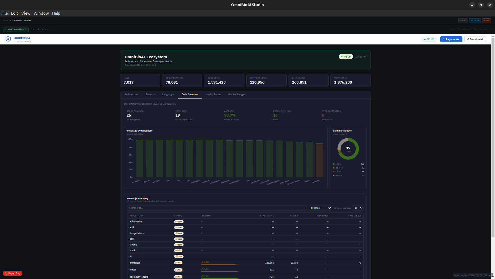
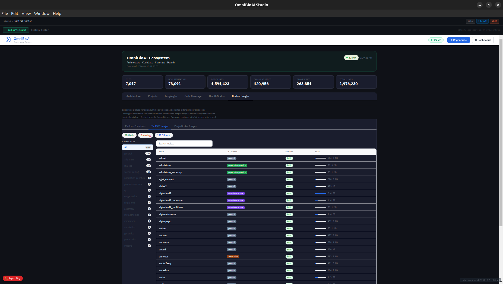
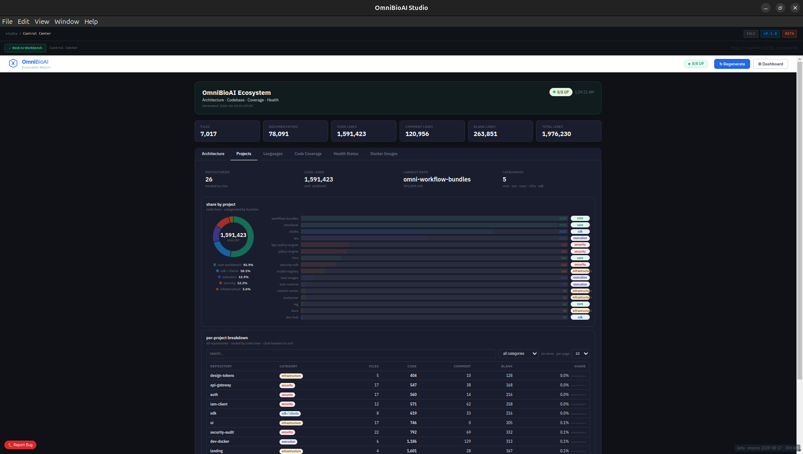

# OmniBioAI Studio

> Desktop orchestration platform for AI-powered bioinformatics computation

**OmniBioAI Studio** is an Electron desktop app that launches and manages the full OmniBioAI stack — locally, on HPC clusters, or in the cloud — with a single click.

---

## ✨ What's New in v0.3.0-beta

- **IDE Services** — JupyterLab, RStudio, and VS Code Server managed directly from Studio UI with start/stop/status controls and one-click browser launch
- **IDE Layer** — dedicated section on the Services page with per-container lifecycle management (Start / Stop / Open) and real-time status polling
- **Launcher backend** — Express API using Docker socket for IDE container control; no binary dependency, works on ARM64
- **License key system** — 30-day trial keys (OMNI-XXXX-XXXX-XXXX-XXXX format)
- **Sentry error tracking** — automatic error reporting across all services
- **Bug report button** — 🐛 in-app bug reporting via Studio UI
- **Cython IP protection** — core business logic compiled to .so binaries
- **MySQL-backed license server** — license validation with MySQL persistence
- **DEV_MODE flag** — replaces BETA_MODE for cleaner build configuration
- **1010+ bioinformatics tools** — 510 HTTP API tools + 500 Slurm execution tools
- **600+ workflows (Nextflow/WDL/CWL/Snakemake)**
- **12 agentic omics pipelines with Human-in-the-Loop (HITL)**
- **Windows installer** — NSIS .exe installer added alongside DMG and AppImage
- **Zero-trust security control plane** — JWT authentication + RBAC/ABAC policy enforcement on every request
- **API Gateway** — single enforced entry point for all service traffic
- **HPC Policy Engine** — per-user GPU/CPU quota governance
- **Security Audit Service** — async audit logging via Redis Streams (user, action, decision, latency, trace ID)
- **Redis token caching** — validated tokens cached (TTL=300s) with pub/sub invalidation on logout
- Internal service header propagation (`X-Internal-Service`, `X-Trace-Id`, `X-User-Id`) across all TES calls
- Fail-closed on auth/policy/HPC failure; fail-open on audit (never blocks requests)
- **RAG V6 FAISS index** — persistent vector store with recursive document indexing for large literature corpora
- **Unified Metrics Dashboard** — embedded Grafana dashboard in Studio with 4 tabs (Services, Platform Overview, LIMS, RAG); silent Bearer token auth via service account; no login page
- **13-panel observability stack** — Service Health, Request Rate, HTTP Error Rate, Response Latency, Container CPU/Memory (cAdvisor), Celery Queue Depth, Redis Health, RAG Query Latency (p50/p95/p99), JWT Auth Rate
- **django-prometheus instrumentation** — real HTTP metrics from Workbench and LIMS (204+ metric series each)
- **cAdvisor + redis-exporter** — container resource monitoring + Redis/Celery queue depth metrics
- **OmniBioAI dark theme** — Grafana and Prometheus themed to match Studio design tokens (`--color-bg: #0f1117`, `--color-accent: #00e5a0`)
- **@man4ish/ui integration** — GrafanaViewer uses shared Button, Card, Badge, Spinner components from the OmniBioAI UI library
- **Auto-generated secrets** — `AUTH_SECRET_KEY`, `MYSQL_ROOT_PASSWORD`, `GF_ADMIN_PASSWORD`, `LICENSE_SECRET` generated with `crypto.randomBytes` on first launch; stored in repo `.env`
- **Grafana service account token auth** — anonymous access disabled; Bearer token provisioned automatically on stack startup
- **Auth endpoint rate limiting** — nginx rate limits `/auth` to 10r/m burst 5 to prevent brute force
- **0 npm vulnerabilities** — Electron 28→41, vite 5→8, shell-quote critical RCE fixed, 11 total CVEs resolved
- **Prometheus routing through nginx** — direct port closed; all traffic via `/_svc/prometheus` with sub_filter theme injection

### v0.1.0-beta.1
- Full local stack launch with containerized services
- Live service health monitoring (Control Center)
- Docker image dashboard (platform + plugin images)
- Dev Hub with knowledge graph + RAG UI
- SDK Launcher for OmniBioAI Python SDK
- Mode-aware startup: Local / HPC / Cloud / Hybrid
- LLM configuration: Ollama (local) + Claude API + OpenAI
- Cloud execution: AWS Batch / Azure Batch / GCP Batch / Kubernetes
- HPC execution: Slurm / PBS / LSF via TES

---

## 🖥 Screenshots

### Control Center — Architecture View

*Full microservices map with zero-trust security control plane — 8/8 services UP*

### Health Monitoring

*Real-time service health, response latency per service, disk monitoring*

### Code Coverage

*98.7% average test coverage across 19 repositories*

### Tool SIF Images

*459 bioinformatics tool images built — ~235GB total*

### Ecosystem Overview

*26 repositories · 2M+ lines of code · workflow-bundles is the largest repo*

---

## 📦 Downloads

| Platform | File | Requirements |
|---|---|---|
| macOS (M1/M2/M3/M4) | OmniBioAI-Studio-arm64.dmg | macOS 12+ |
| macOS (Intel) | OmniBioAI-Studio-x64.dmg | macOS 12+ |
| Linux | OmniBioAI-Studio.AppImage | Ubuntu 20.04+ |
| Windows | OmniBioAI-Studio-Setup.exe | Windows 10/11 |

Download from: https://github.com/man4ish/omnibioai-studio/releases/latest

---

## 🔐 Security Control Plane

All requests are enforced through a zero-trust pipeline:

```
Internet / Client
       ↓
api-gateway :8080     ← single entry point, JWT enforcement
       ↓
auth-service :8001    ← JWT validation + Redis cache (TTL=300s)
       ↓
policy-engine :8002   ← RBAC/ABAC authorization decision
       ↓
hpc-policy-engine :8003  ← GPU/CPU quota check (compute requests only)
       ↓
target service (workbench / tes / toolserver / rag)
       ↓
security-audit :8004  ← async audit log → Redis Streams (never blocks)
```

**Failure policy:**
| Layer | On failure |
|---|---|
| Auth | FAIL CLOSED → HTTP 401 |
| Policy | FAIL CLOSED → HTTP 403 |
| HPC quota | FAIL CLOSED → HTTP 403 |
| Audit | FAIL OPEN → ignored |

---

## 🖥 Services

| Service | Port | Description |
|---|---|---|
| **API Gateway** | :8080 | Zero-trust entry point — auth + policy + HPC enforcement |
| **Auth Service** | :8001 | JWT issuance, validation, refresh, logout |
| **Policy Engine** | :8002 | RBAC/ABAC authorization decisions |
| **HPC Policy Engine** | :8003 | GPU/CPU quota governance per user/team |
| **Security Audit** | :8004 | Async audit logging via Redis Streams |
| Workbench | :8000 | Main bioinformatics platform (Django) |
| TES | :8081 | Task Execution Service (Slurm / AWS / Azure / GCP / K8s) |
| ToolServer | :9090 | FastAPI bioinformatics tool server |
| Model Registry | :8095 | ML model versioning and serving |
| LIMS | :7000 | Lab Information Management System |
| Control Center | :7070 | Service health + Docker image dashboard |
| RAG | :8090 (ext) / :8096 (int) | PubMed literature AI + DeepSeek RAG (V6 FAISS, persistent vector store) |
| Dev Hub | :5173 / :8082 | Knowledge graph + embeddings UI |
| Workflow Bundles | :8098 | WDL/Nextflow/Snakemake/CWL workflow bundle server |
| Tool Images | :8097 | Bioinformatics tool image registry |
| Videos | :8086 | Tutorial and demo video server |
| Launcher | :5190 | OmniBioAI SDK UI + IDE container lifecycle API |
| Ollama | :11434 | Local LLM inference |
| OPA | :8181 | Open Policy Agent (policy rules backend) |
| cAdvisor | :8585 | Docker container CPU/memory metrics for Prometheus |
| redis-exporter | :9121 | Redis metrics exporter (queue depth, memory, clients) |
| nginx-router | :80 | Reverse proxy — unified entry point for all web services |
| Prometheus | internal | Metrics collection (no direct port — access via `/_svc/prometheus`) |
| Grafana | :3000 | Metrics dashboards (embedded in Studio Metrics tile) |

### IDE Services (managed via Launcher)

| Service | Port | Description | Default credential |
|---|---|---|---|
| **JupyterLab** | :8888 | Interactive notebooks — full bioinformatics stack (scanpy, DESeq2, scVelo, cellxgene…) | token: `$JUPYTER_TOKEN` |
| **RStudio Server** | :8787 | R + Bioconductor — Seurat, DESeq2, scran, monocle3, tidyverse | password: `$RSTUDIO_PASSWORD` |
| **VS Code Server** | :8083 | Python + R + Nextflow + WDL extensions | password: `$VSCODE_PASSWORD` |

IDE services are started, stopped, and monitored from **Studio → Services → IDE Layer** or **Studio → IDE Services**. They can also be launched directly from the **Launcher** page when opening a registry object in an analysis environment.

### Plugin images (pulled on-demand by TES)

| Image | Description |
|---|---|
| `omnibioai-plugin-scanpy` | Single-cell RNA-Seq analysis |
| `omnibioai-plugin-fastq-qc` | FASTQ quality control (FastQC + MultiQC) |
| `omnibioai-plugin-fastq-trimmer` | Read trimming (Trimmomatic) |
| `omnibioai-plugin-rnaseq-analysis` | Bulk RNA-Seq (DESeq2/edgeR) |
| `omnibioai-plugin-workflow-runner` | WDL/Nextflow/Snakemake/CWL execution |
| `omnibioai-plugin-variant-annotation` | Variant annotation (SnpEff/ANNOVAR) |
| `omnibioai-plugin-marker-identification` | Marker gene identification |
| `omnibioai-plugin-phenotype-association` | GWAS + phenotype association |

---

## 📊 Observability

OmniBioAI Studio includes a full observability stack accessible from the **Metrics** tile in the Workbench.

### Grafana Dashboards (4)

| Dashboard | Description |
|---|---|
| OmniBioAI Services | Service health, request rate, latency, container resources |
| OmniBioAI Platform Overview | Full platform architecture metrics |
| OmniBioAI LIMS | Lab information management system metrics |
| OmniBioAI RAG | RAG pipeline query latency and throughput |

### Prometheus Scrape Targets (7)

| Target | Metrics |
|---|---|
| workbench:8000 | Django HTTP requests, latency, errors (django-prometheus) |
| lims:7000 | Django HTTP requests, latency, errors (django-prometheus) |
| rag:8096 | RAG query duration histogram, query count |
| auth-service:8001 | JWT auth success/failure counters |
| control-center:7070 | Service health metrics |
| cadvisor:8080 | Container CPU, memory, network per service |
| redis-exporter:9121 | Redis memory, connected clients, list lengths |

### Security

- Grafana anonymous access disabled — Bearer token auto-provisioned on startup
- Auth endpoints rate-limited (10 req/min, burst 5)
- All secrets auto-generated with `crypto.randomBytes(32)` on first launch

---

## 🧪 IDE Services

OmniBioAI Studio manages three browser-based IDE environments as Docker containers. These are controlled from two places in Studio:

**Services page → IDE Layer** — table view with Start / Stop / Open per service, same as all other platform services.

**IDE Services page** — card view showing status badge (Running / Starting / Stopped) and a direct Open button. When running, JupyterLab opens with the auth token pre-filled for automatic login.

### Starting IDEs

From Studio → Services → IDE Layer, click **Start** on any stopped IDE. The status badge polls every 5 seconds and flips to **Running** once the container is up. Click **Open →** to launch it in your system browser.

Alternatively, from Studio → Launcher, select a registry object and click **Open in JupyterLab**, **Open in VS Code Server**, or **Open in RStudio** — the IDE opens in the browser with object context pre-loaded.

### IDE credentials

Set in `.env` before starting the stack:

```bash
JUPYTER_TOKEN=devtoken        # passed as ?token= in URL for auto-login
RSTUDIO_PASSWORD=omnibioai    # RStudio Server login password
VSCODE_PASSWORD=omnibioai     # VS Code Server login password
```

### Pre-installed packages

**JupyterLab** — scanpy, anndata, scVelo, squidpy, gseapy, biopython, pysam, cellxgene, leidenalg, harmonypy, decoupler, pydeseq2, omnipath, DESeq2, edgeR, limma, Seurat (via conda)

**RStudio** — DESeq2, edgeR, limma, Seurat, clusterProfiler, EnhancedVolcano, ComplexHeatmap, SingleCellExperiment, scran, scater, monocle3, tidyverse, ggplot2, pheatmap, patchwork

**VS Code Server** — ms-python.python, REditorSupport.r, nextflow-io.nf-lang, broadinstitute.wdl extensions; scanpy, anndata, scVelo, pydeseq2, gseapy, biopython, pysam

---

## 🧰 Bioinformatics Tools (1010+)

### HTTP API Tools (510)
Direct REST API integrations — no compute needed:
- Genomics: Ensembl, NCBI, ClinVar, gnomAD, dbSNP
- Proteins: UniProt, AlphaFold, PDB, InterPro
- Pathways: KEGG, Reactome, WikiPathways, GO
- Literature: PubMed, Europe PMC, Semantic Scholar
- Drugs: ChEMBL, DrugBank, PharmGKB, OpenFDA
- Single Cell: CellxGene, HCA, Broad SCP
- Metabolomics: HMDB, LipidMaps, MetaboAnalyst
- And 280+ more across all omics domains

### Slurm/HPC Tools (500)
Compute-heavy tools executed on HPC/cloud:
- Alignment: BWA, STAR, HISAT2, Minimap2
- Variant Calling: GATK, DeepVariant, Clair3, Mutect2
- RNA-seq: DESeq2, edgeR, Salmon, Kallisto
- Single Cell: Seurat, Scanpy, Cell Ranger
- ML/AI: PyTorch, TensorFlow, ESM2, AlphaFold2
- Proteomics: MSFragger, MaxQuant, DIA-NN
- And 90+ more

---

## 🧬 Bioinformatics Modules

### Core Platform
Home · OnboardAI · Omni Assistant · Job Monitor · Plugin Manager · Admin

### Workflows
Workflow Runner · Workflow Builder · Agent Studio · Pipeline Dashboard · Multi-Agent Bio Orchestrator · Workflow Compiler

### Omics Analysis
RNA-Seq · Single Cell (scRNA-Seq) · Exome Analysis · FASTQ QC · Proteomics · Metabolomics

### AI & Intelligence
Drug Target AI · Literature AI · Pathway Enrichment · Bio Hypothesis AI · Bio Narrator AI

### Learn
Getting Started · Tutorials · Demo Workflows · Example Pipelines · Developer Hub · Videos

---

## 📋 Requirements

| Requirement | Minimum | Recommended |
|---|---|---|
| RAM | 16GB | 32GB |
| Disk | 50GB free | 100GB free |
| Docker | Engine 24+ | Docker Desktop |
| OS | Ubuntu 20.04+ | Ubuntu 22.04+ |
| GPU | — | NVIDIA + nvidia-container-toolkit |

Also required:
- `jq` — `sudo apt install jq` or `brew install jq`
- Docker Compose v2 — included with Docker Engine 24+

---

## 🚀 Quick Start

### Stack only (headless / no Electron)

```bash
git clone https://github.com/man4ish/omnibioai-studio
cd omnibioai-studio
cp .env.example .env
# Edit .env — fill in your paths and secrets
docker compose up -d
```

Then register your first user and get a token:

```bash
# Register
curl -X POST http://localhost:8001/auth/register \
  -H "Content-Type: application/json" \
  -d '{"email":"admin@example.com","password":"yourpassword","full_name":"Admin"}'

# Login — returns JWT token
curl -X POST http://localhost:8001/auth/login \
  -H "Content-Type: application/json" \
  -d '{"email":"admin@example.com","password":"yourpassword"}'

# Use token through gateway
curl -H "Authorization: Bearer <token>" http://localhost:8080/api/tools
```

### Linux (AppImage)

```bash
chmod +x "OmniBioAI-Studio.AppImage"
./"OmniBioAI-Studio.AppImage"
```

1. Enter your license key when prompted
2. Select execution mode (Local recommended for first run)
3. Set Data Directory and Work Directory in **Settings**
4. Click **Boot System** on the Launch page
5. Open Workbench at http://localhost:8000

### From source

```bash
npm install
npm run dev              # development mode
npm run build            # build AppImage (Linux)
npm run build:mac        # build DMG (macOS)
npm run build:win        # build EXE (Windows)
```

---

## 🔑 License & Access

OmniBioAI Studio requires a license key for first launch.

### Getting a License
Contact: manish@omnibioai.org for beta access

### License Key Format
OMNI-XXXX-XXXX-XXXX-XXXX (30-day trial)

### First Launch Flow
1. Download installer (DMG / AppImage / EXE)
2. Launch OmniBioAI Studio
3. Enter license key when prompted
4. App validates key against license server
5. Platform pulls images from ghcr.io automatically
6. Studio launches — ready to use!

### Offline Grace Period
License is cached locally for 7 days offline use.

---

## 🔑 Environment Variables

Copy `.env.example` to `.env` and fill in:

```bash
# Database
MYSQL_ROOT_PASSWORD=your-db-password
MYSQL_DEFAULT_DB=omnibioai

# Auth (change in production)
AUTH_SECRET_KEY=your-secret-key-here

# Network
HOST_IP=0.0.0.0

# Paths (absolute paths on host)
DB_INIT_DIR=/path/to/omnibioai-studio/db-init
WORKSPACE_HOST=/path/to/workspace
WORK_DIR=/path/to/work
DATA_DIR=/path/to/data
VIDEO_DIR=/path/to/videos

# AI API Keys (optional)
ANTHROPIC_API_KEY=
OPENAI_API_KEY=

# IDE Services
JUPYTER_TOKEN=devtoken
RSTUDIO_PASSWORD=omnibioai
VSCODE_PASSWORD=omnibioai

# Build
DEV_MODE=false

# Error reporting (set empty to disable)
SENTRY_DSN=
```

---

## 🔗 GHCR Authentication

Private service images require authentication.
**Beta users receive a GitHub token automatically with their license key.**

Manual setup:
```bash
export GITHUB_TOKEN=your_github_personal_access_token
export GITHUB_USER=your_github_username
echo $GITHUB_TOKEN | docker login ghcr.io -u $GITHUB_USER --password-stdin
```

Token needs `read:packages` scope.

**Public images (no auth needed):**
- `omnibioai-base` (3.4GB — heavy dependencies, pull once)
- `omnibioai-dev-env`
- `omnibioai-tool-runtime`
- All `omnibioai-plugin-*` images (122 plugins)

**Private images (token required):**
- `omnibioai-app` (~170MB — app code only, fast updates)
- All core service images

---

## 🐛 Error Reporting

OmniBioAI Studio includes built-in error reporting via Sentry.

- Click the 🐛 **Report Bug** button in the Studio UI
- Fill in title, description and severity
- Report sent automatically to our dashboard
- We'll respond within 24 hours during beta

To disable: set SENTRY_DSN= (empty) in .env

---

## ☁️ Execution Backends

### Local
- CPU/GPU execution via Docker
- NVIDIA GPU support with nvidia-container-toolkit

### HPC
- **Slurm** — cluster job submission via TES
- **PBS / LSF** — alternative schedulers
- **Apptainer/Singularity** — container runtime for HPC
- SSH-based remote execution

### Cloud
- **AWS Batch** — S3 input/output, IAM profiles
- **Azure Batch** — Blob storage, managed identity
- **GCP Batch** — Cloud Storage, service accounts
- **Kubernetes** — any K8s cluster via kubeconfig

### LLM
- **Ollama** — local inference (Llama, DeepSeek, Mistral, etc.)
- **Claude API** — Anthropic cloud API
- **OpenAI** — GPT-4 and compatible APIs

---

## 🏗 Architecture

```
┌─────────────────────────────────────────┐
│        OmniBioAI Studio                 │
│     Electron + React (Wizard UI)        │
└──────────────┬──────────────────────────┘
               │ IPC
               ▼
┌─────────────────────────────────────────┐
│        Electron Main Process            │
│  - Config manager (JSON)                │
│  - Docker Compose lifecycle             │
│  - Health check polling                 │
│  - Log streaming                        │
└──────────────┬──────────────────────────┘
               │ docker compose
               ▼
┌─────────────────────────────────────────┐
│     Security Control Plane              │
│  API Gateway · Auth · Policy Engine     │
│  HPC Policy · Security Audit · Redis    │
└──────────────┬──────────────────────────┘
               │ verified requests only
               ▼
┌─────────────────────────────────────────┐
│        Docker Compose Runtime           │
│  Workbench · TES · ToolServer           │
│  Model Registry · LIMS · RAG            │
│  Control Center · Dev Hub · Launcher    │
│  JupyterLab · RStudio · VS Code Server  │
└──────────────┬──────────────────────────┘
               │
               ▼
┌─────────────────────────────────────────┐
│        Execution Backends               │
│  Local GPU/CPU · Slurm/PBS/LSF          │
│  AWS Batch · Azure Batch · GCP          │
│  Kubernetes · Ollama · Claude API       │
└─────────────────────────────────────────┘
```

---

## ⚙ Configuration

Studio stores config at:
- **Linux:** `~/.config/omnibioai/omnibioai.config.json`
- **macOS:** `~/Library/Application Support/omnibioai-studio/omnibioai.config.json`

Key settings:

```json
{
  "mode": "local",
  "settings": {
    "data_dir": "/path/to/omnibioai/data",
    "work_dir": "/path/to/omnibioai/work"
  },
  "llm": {
    "enable_ollama": true,
    "enable_claude": false,
    "claude_api_key": "",
    "enable_openai": false
  },
  "cloud": {
    "enable_aws_batch": false,
    "enable_gcp_batch": false,
    "gcp_project": "",
    "gcp_region": ""
  },
  "hpc": {
    "enabled": false,
    "scheduler": "slurm",
    "hostname": "hpc.university.edu",
    "username": "",
    "private_key": "~/.ssh/id_rsa"
  }
}
```

---

## 🔗 OmniBioAI Ecosystem

OmniBioAI Studio is the **desktop control layer** for:

| Repository | Role |
|---|---|
| `omnibioai` | Main Django workbench + 80+ plugins |
| `omnibioai-api-gateway` | Zero-trust API gateway |
| `omnibioai-auth` | JWT authentication service |
| `omnibioai-policy-engine` | RBAC/ABAC authorization |
| `omnibioai-hpc-policy-engine` | GPU/CPU quota governance |
| `omnibioai-security-audit` | Async audit logging |
| `omnibioai-iam-client` | Python SDK for auth integration |
| `omnibioai-tes` | Task Execution Service |
| `omnibioai-toolserver` | FastAPI tool API |
| `omnibioai-lims` | Lab data management |
| `omnibioai-model-registry` | ML model versioning |
| `omnibioai-control-center` | Health + image dashboard |
| `omnibioai-rag` | PubMed RAG pipeline |
| `omnibioai-dev-hub` | Knowledge graph + embeddings |
| `omnibioai-workflow-bundles` | WDL/Nextflow/Snakemake bundles |
| `omnibioai-tool-images` | 80+ bioinformatics tool containers |
| `omnibioai-launcher` | SDK UI + IDE container lifecycle API |
| `omnibioai_sdk` | Python SDK client |
| `omnibioai-dev-docker` | DGX/GPU development environment |
| `omnibioai-security-sdk` | Security SDK for service auth integration |
| `omnibioai-design-tokens` | Shared design tokens and theme system |
| `omnibioai-ui` | Shared UI component library |
| `omnibioai-landing` | Public-facing landing page |

---

## 🗺 Roadmap

**v0.2.0-beta** ✅
- License key system (OMNI-XXXX-XXXX-XXXX-XXXX, 30-day trial)
- Sentry error tracking + in-app bug report button
- Cython IP protection (.so compiled binaries)
- MySQL-backed license server
- DEV_MODE flag (replaces BETA_MODE)
- 1010+ bioinformatics tools (510 HTTP API + 500 Slurm)
- Windows NSIS .exe installer
- Zero-trust JWT authentication on every request
- RBAC/ABAC policy engine
- HPC quota governance
- Async audit logging via Redis Streams
- Redis token caching with pub/sub invalidation
- Internal service header propagation

**v0.3.0-beta — Current Release ✅** (June 2026)
- DMG + AppImage + EXE installers via GitHub Actions
- Auto-updater for all platforms
- Cloudflare-integrated beta signup with automatic license delivery
- IDE Services — JupyterLab, RStudio, VS Code Server with full lifecycle management
- IDE Layer on Services page with Start / Stop / Open controls
- Launcher backend API for IDE container control via Docker socket
- One-click browser launch with automatic token authentication
- Public beta announcement
- Unified Grafana metrics dashboard embedded in Studio
- Full observability stack: cAdvisor + redis-exporter + django-prometheus
- OmniBioAI dark theme on Grafana and Prometheus
- Zero npm vulnerabilities (Electron 28→41 security upgrade)
- Auto-generated secrets on first launch
- Grafana service account token auth (anonymous access disabled)
- @man4ish/ui + @man4ish/design-tokens integrated into Studio

**v0.4 — Cloud & HPC**
- AWS/Azure/GCP job submission UI
- Cost estimation per workflow
- Multi-tenant workspace isolation

**v0.5 — Enterprise**
- SSO / SAML integration
- Role management UI
- HIPAA compliance reporting from audit logs
- Cost attribution per user/team

---

## 🖥 Platform Notes

**ARM machines (Apple Silicon, AWS Graviton):**
Some service images were built for `linux/amd64`. They run via emulation on ARM with a warning:
```
The requested image's platform (linux/amd64) does not match the detected host platform (linux/arm64/v8)
```
This is expected and harmless for development. For production ARM deployments, rebuild affected images with `--platform linux/arm64`.

---

## 🐛 Known Issues (Beta)

- System MySQL/Redis must be stopped before starting: `sudo systemctl stop mysql redis-server`
- `GITHUB_TOKEN` must be set manually for private image pull
- macOS DMG not yet code-signed (GateKeeper warning expected)
- Windows installer not yet code-signed
- Kubernetes health check requires `~/.kube/config`
- policy-engine and hpc-policy-engine do not expose a `/health` endpoint (returns 404, services are running)
- License server requires MySQL (included in docker-compose)
- First launch requires internet connection for license validation
- 7-day offline grace period after initial validation
- Bug reports sent to Sentry (can be disabled via SENTRY_DSN= in .env)
- IDE Services status polling requires the Launcher container to be running
- JupyterLab token must match `JUPYTER_TOKEN` in `.env` for auto-login to work
- Grafana service account token stored as `GF_STUDIO_TOKEN` in `.env` — regenerate with `docker compose restart grafana` if token is revoked
- cAdvisor requires privileged mode and `/dev/kmsg` device access
- Prometheus port not exposed directly — access only via `/_svc/prometheus`

---

## 📄 License

Apache 2.0 — see [LICENSE](LICENSE)

---

## 👤 Author

Manish Kumar — [GitHub](https://github.com/man4ish)

---

*OmniBioAI Studio is not a bioinformatics tool — it is a desktop orchestration system for distributed, secure, AI-native scientific computation.*