# OmniBioAI Studio

> Desktop orchestration platform for AI-powered bioinformatics computation

**OmniBioAI Studio** is an Electron desktop app that launches and manages the full OmniBioAI stack — locally, on HPC clusters, or in the cloud — with a single click.

## System documentation

- [System architecture](docs/SYSTEM_ARCHITECTURE.md) — boundaries, flows, deployment topology, and the current 41-service Compose catalog
- [Security hardening](docs/SECURITY-COMPOSE-HARDENING.md) — production Compose security and development overrides
- [Integration tests](tests/integration/README.md) — end-to-end test setup
- [Operations scripts](scripts/README.md) — backup, validation, and deployment utilities

---

## ✨ What's New in v0.7.1

- 🔒 **Security & integrity hardening** — closed an SSRF exposure in toolserver (routed through the authenticated gateway) and an information-disclosure surface in Control Center; hardened Neo4j (credential rotation, network restriction, Access-gated remote entry)
- 🌐 **Nginx proxy fixes** — resolved recurring proxy bugs affecting RAG, Jupyter, RStudio, and VS Code
- 🛡️ **New admin views** — Compliance Center, Audit Explorer, Audit Logs, API Keys & Service Accounts, Security Posture, Billing (Usage/Overview)
- 🔧 **Plugin execution fixes** — found and fixed real correctness bugs in the plugin execution layer
- 📚 **Documentation rewrite** — 28+ plugins and core services rewritten to reflect verified, not assumed, behavior

### v0.7.0 ✅
- 🔐 **Unified license key system** (`OMNI-XXXX-XXXX-XXXX-XXXX`) — one key works for web + desktop, auto-creates user on first validation, same JWT as OAuth login
- 🌐 **webstudio.omnibioai.org fully working** — license key login enforced, all workbench pages loading correctly, service worker fixed, nginx routes fixed (`/license/`, `/roles/`), Control Center JWT cookie fallback
- 👥 **Team expansion** — Dr. Rajnish Kumar (Scientific Consultant, SR University), Praveen C.V. Raghavulu (Scientific Advisor, KUMC); About page restructured as company team page
- 🛠 **12,110 bioinformatics tools** (up from 11,577) — 100+ new HTTP API tools added, all tools validated (100% clean), 0 duplicates, 0 ToolSpec errors
- 🤖 **Tool selection AI improved** — GPU enabled for Ollama (57x faster: 120s → 2.1s), accuracy 0% → 60%, Recall@K 60% → 85%
- 📦 **1,000 ARM64 SIF images**
- 🔧 **Control Center web service** added
- 💰 **Billing service** integrated
- 🛡️ **Admin Console** live at admin.omnibioai.org — authenticated E2E certified (8/8)

### v0.6.0-beta ✅
- 🌐 Web version at webstudio.omnibioai.org — no installation required
- 🔐 SSO & OAuth2 — Google, GitHub, and Microsoft sign-in
- 🛡️ Cloudflare Access — secure invite-only email whitelist
- 🧬 12,000+ bioinformatics tools across HTTP APIs, ARM64, x86, and Kubernetes
- 📦 1,120+ container images (320 Docker + 800 ARM64 SIF) hosted on GHCR and Hugging Face
- 🔌 225+ bioinformatics & AI plugins covering scRNA-seq, WGS, WES, proteomics, spatial, and more
- ⚙️ 600+ workflow bundles for Nextflow, WDL, CWL, and Snakemake
- 🤖 36M PubMed abstracts indexed with a 150-domain RAG pipeline (PubMedBERT, FAISS, BM25, RRF, Neo4j)
- 🤗 One-click Hugging Face Push from the Model Registry
- 📊 Live platform metrics dashboard with architecture, service health, and coverage

### v0.4.0-beta ✅
- **Version unification** — all UI components, sidebar, badge, logs, and settings now consistently report `v0.4.0-beta`
- **23 services fully operational** — all layers (Data, Security Control Plane, Execution, AI, Developer) green
- **1,010 registered tools** — confirmed live in Jobs → Registered Tools panel *(platform-wide tooling, including HPC/cloud/orchestration integrations, totals 11,000+ — see Bioinformatics Tools section below)*
- **7 execution servers** — `local_real`, `slurm_local`, `aws_batch_prod`, `aws_batch_demo`, `azure_batch_demo`, `gcp_batch_demo`, `enrichment_remote`
- **claude-sonnet-4-20250514** as default orchestrator model in LLM configuration
- **IDE Services all RUNNING** — JupyterLab (:8888), RStudio (:8787), VS Code Server (:8083)
- **Beta Cloud mode** — connects to `webstudio.omnibioai.org`; MySQL, Workbench, TES, Ollama tunnels all reachable
- **Report Bug modal** — title, description, email, severity (Low / Medium / High / Critical) with Submit Bug Report

### v0.3.0-beta ✅
- IDE Services — JupyterLab, RStudio, and VS Code Server managed directly from Studio UI
- IDE Layer — dedicated section on Services page with per-container lifecycle management
- Launcher backend — Express API using Docker socket for IDE container control; ARM64-compatible
- Unified Grafana metrics dashboard embedded in Studio
- Full observability stack: cAdvisor + redis-exporter + django-prometheus
- OmniBioAI dark theme on Grafana and Prometheus
- Auto-generated secrets on first launch via `crypto.randomBytes`
- Grafana service account token auth (anonymous access disabled)
- Zero npm vulnerabilities (Electron 28→41, vite 5→8, all CVEs resolved)
- DMG + AppImage + EXE installers via GitHub Actions
- Public beta announcement + Cloudflare-integrated beta signup

### v0.2.0-beta ✅
- License key system (OMNI-XXXX-XXXX-XXXX-XXXX, 30-day trial)
- Sentry error tracking + in-app bug report button
- Cython IP protection (.so compiled binaries)
- MySQL-backed license server
- 1010+ bioinformatics tools (510 HTTP API + 500 Slurm)
- Windows NSIS .exe installer
- Zero-trust JWT authentication, RBAC/ABAC policy engine
- HPC quota governance + async audit logging via Redis Streams

### v0.1.0-beta ✅
- Full local stack launch with containerized services
- Live service health monitoring
- Docker image dashboard
- Dev Hub with knowledge graph + RAG UI
- Mode-aware startup: Local / HPC / Cloud / Hybrid
- LLM configuration: Ollama + Claude API + OpenAI
- Cloud execution: AWS Batch / Azure Batch / GCP Batch / Kubernetes
- HPC execution: Slurm / PBS / LSF via TES

---

## 🖥 Screenshots

### Runtime Mode — Service Health
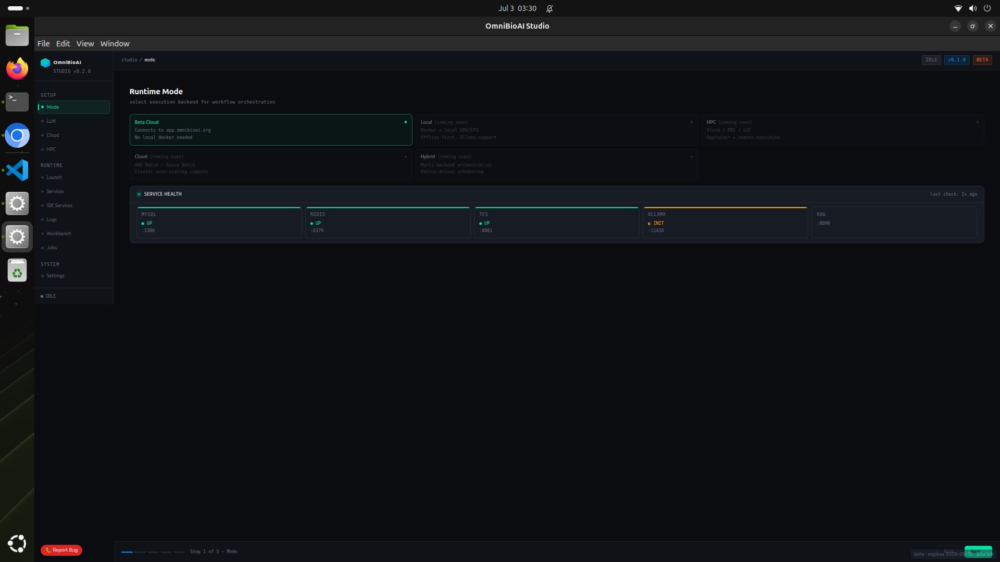
*Beta Cloud selected — MySQL, Redis, TES, Workbench UP; Ollama initializing*

### Workbench — Module Overview
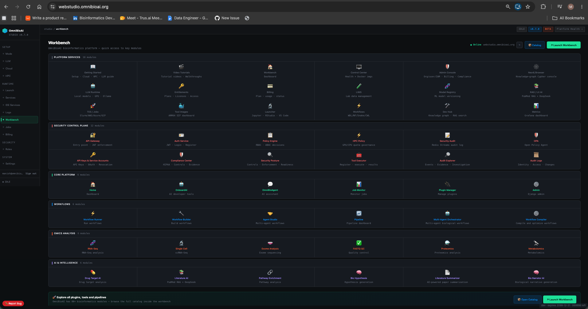
*Workbench catalog across 6 sections; a fully authorized user sees 18 Platform Services and 12 Security Control Plane modules*

### LLM Configuration
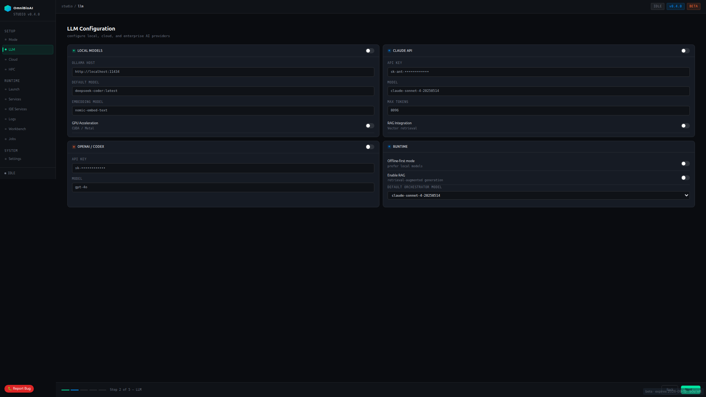
*Local Ollama (deepseek-coder), Claude API, OpenAI/Codex, and runtime orchestration settings*

### Cloud Configuration
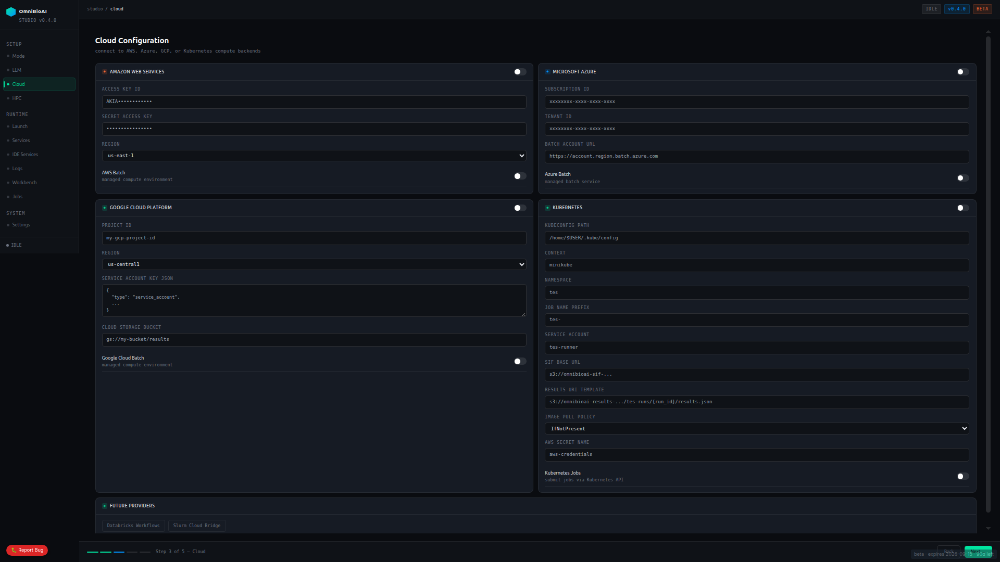
*AWS, Azure, GCP, and Kubernetes execution backends with full credential management*

### HPC Configuration
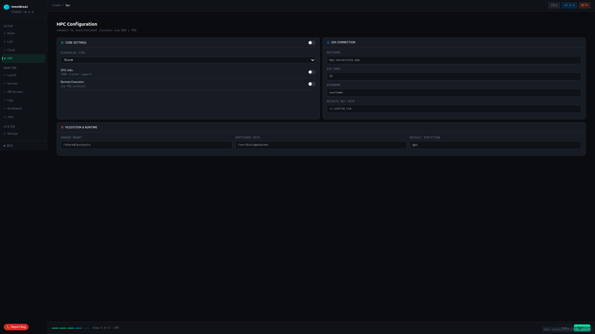
*Slurm scheduler, SSH connection, GPU jobs, TES remote execution, filesystem & runtime settings*

### Launch — Execution Console
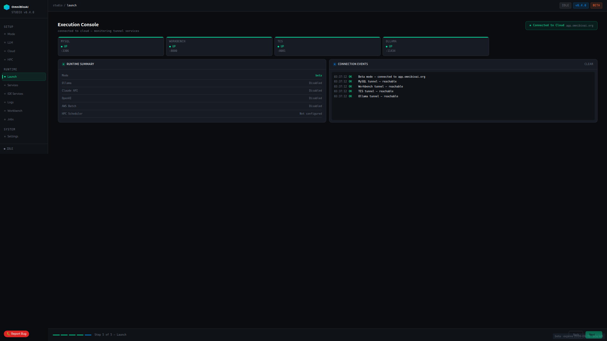
*Connected to Beta Cloud — all tunnels reachable, runtime summary visible*

### Services — Full Stack
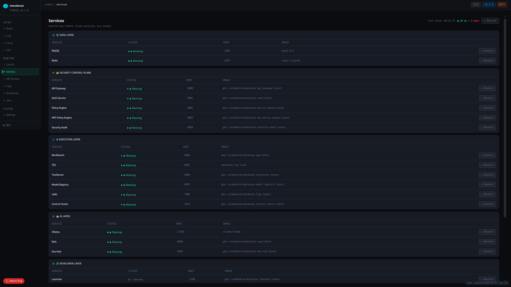
*40 Compose services across Data, Security Control Plane, Execution, AI, and Developer layers*

### IDE Services
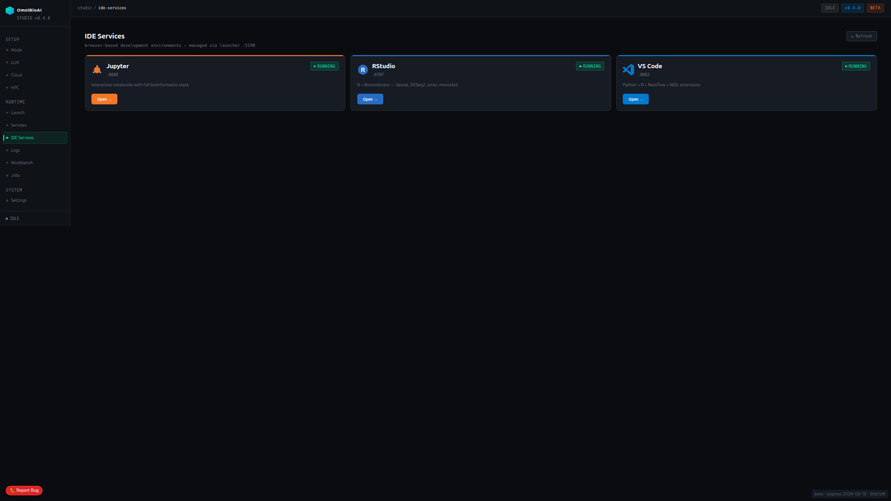
*JupyterLab, RStudio, VS Code Server — all RUNNING, managed via Launcher :5190*

### Live Logs
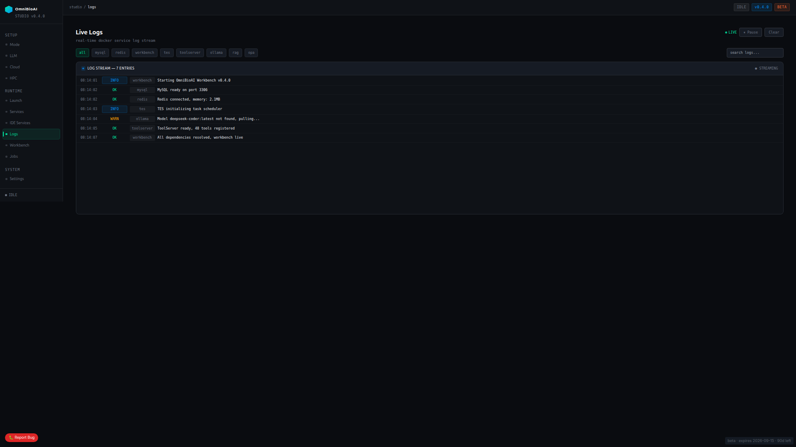
*Real-time log stream — 7 entries, filterable by service, live streaming*

### Jobs — TES Execution Engine
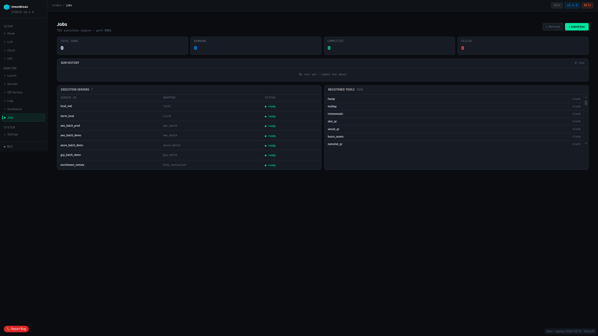
*1,010 registered tools · 7 execution servers (local, Slurm, AWS, Azure, GCP, enrichment_remote)*

### Settings
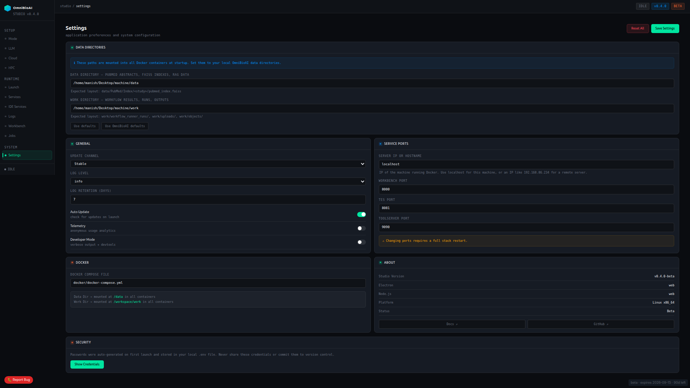
*Data directories, service ports, Docker compose file, security, About panel*

### Bug Report
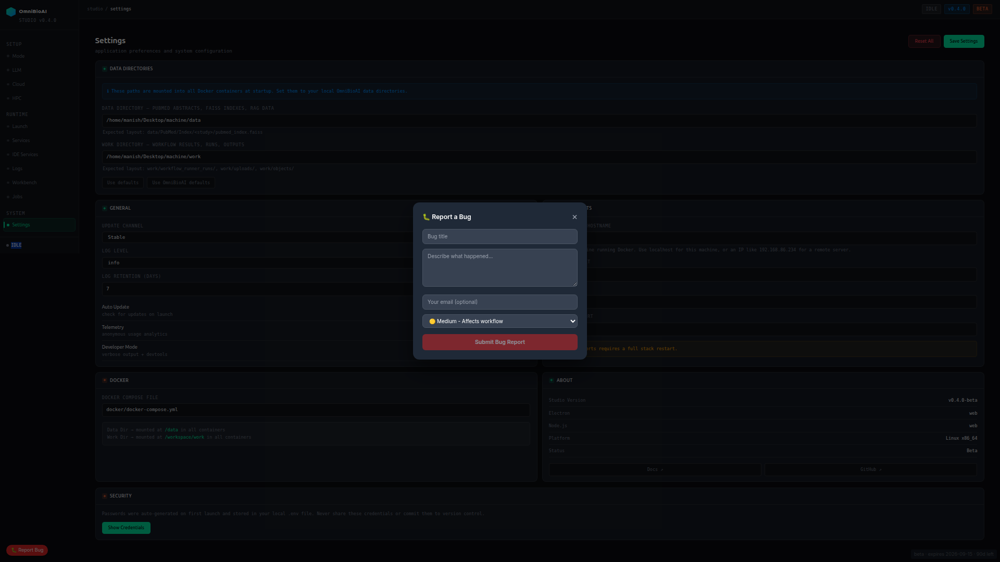
*In-app bug reporting with title, description, email, and severity selector*

---

## 📦 Downloads

| Platform | File | Requirements |
|----------|------|--------------|
| macOS Apple Silicon (M1/M2/M3/M4) | `OmniBioAI-Studio-arm64.dmg` | macOS 12+ |
| macOS Intel | `OmniBioAI-Studio-x64.dmg` | macOS 12+ |
| Linux x86_64 AppImage | `OmniBioAI-Studio.AppImage` | Ubuntu 20.04+ |
| Linux x86_64 DEB | `OmniBioAI-Studio.deb` | Ubuntu / Debian |
| Linux x86_64 RPM | `OmniBioAI-Studio.rpm` | RHEL / Fedora |
| Linux ARM64 AppImage | `OmniBioAI-Studio-arm64.AppImage` | aarch64, Ubuntu 20.04+ |
| Linux ARM64 DEB | `OmniBioAI-Studio-arm64.deb` | Ubuntu / Debian ARM64 |
| Linux ARM64 RPM | `OmniBioAI-Studio-arm64.rpm` | RHEL / Fedora ARM64 |
| Windows | `OmniBioAI-Studio-Setup.exe` | Windows 10/11 + WSL2 |

Download from: https://github.com/OmniBioAI/omnibioai-studio/releases/latest

---

## 📊 Live Platform Proof

Real-time architecture, codebase metrics, coverage, and service health are publicly viewable at:

**[control.omnibioai.org](https://control.omnibioai.org)**

---

## 🔐 Security Control Plane

The Workbench exposes 12 security modules to a fully authorized user. Tiles are permission-gated, and the owning backend remains authoritative for every request.

| Module | Purpose |
|---|---|
| API Gateway | Authenticated entry point and JWT enforcement |
| Auth Service | Authentication and identity APIs |
| Policy Engine | RBAC and ABAC authorization decisions |
| HPC Policy | Compute quota and governance |
| Security Audit | Backend security-audit service and API |
| OPA | Open Policy Agent runtime |
| API Keys & Service Accounts | Organization API key and OAuth client lifecycle |
| Compliance Center | HIPAA-aligned control history and verification evidence |
| Security Posture | Evidence-backed control and readiness overview |
| Tool Executor | Controlled tool registration and execution surface |
| Audit Explorer | Administrator-facing security event investigation and evidence |
| Audit Logs | Identity and administrative audit trail |

Authentication is JWT-based. Authorization combines global roles, organization roles, explicit permissions, RBAC/ABAC policy decisions, and tenant-aware organization scoping. Cross-tenant administration is reserved for the dedicated `platform_admin` role and its platform permissions.

## Admin Console / Control Center

`omnibioai-control-center` provides an operations-focused Control Center and a permission-aware Admin Console from one codebase. Current administrative surfaces include organizations, users, teams, roles and permissions; SSO/SAML, MFA policy, sessions, API keys, OAuth clients, and service accounts; billing and entitlements; HIPAA-aligned compliance evidence; security posture; and audit investigation.

The audit surfaces are distinct:

- **Security Audit** is the backend security-event service and API.
- **Audit Explorer** is the read-only administrator investigation and evidence view over Security Audit events.
- **Audit Logs** is the identity and platform administrative audit trail.

See the [Control Center Admin Console guide](https://github.com/OmniBioAI/omnibioai-control-center/blob/main/docs/admin-console/README.md) for the maintained feature catalog and authorization boundaries.

## 🔐 Browser Authentication

Studio web sessions use the shared OmniBioAI Auth flow. The browser keeps the short-lived access token for API calls; refresh-session state is managed by the server-set session cookie. JWT authentication, explicit permissions, RBAC/ABAC decisions, and organization scoping are enforced by the owning services.

The Workbench hides permission-gated tiles when the validated session lacks the required permission. This is a user-interface convenience only; backend authorization remains authoritative.

## 🖥 Services

### Data Layer
| Service | Port | Image |
|---------|------|-------|
| MySQL | :3306 (internal only in production/release — see below) | mysql:8.0 |
| Redis | :6379 (internal only in production/release — see below) | redis:7-alpine |

**Production/release** (`docker-compose.release.yml`, the config packaged
into the Electron app): MySQL and Redis are **not published to the host** —
reachable only inside the Compose network, as `mysql:3306` / `redis:6379`.
Every other service still addresses them exactly that way.

**Development**: the local dev stack (`docker-compose.yml`) still publishes
both directly (`:3306` / `:6380`) for convenience, as it always has. To get
the same local access against the release stack instead, layer the explicit
`docker-compose.release.dev-ports.yml` overlay:
```bash
docker compose -f docker-compose.release.yml -f docker-compose.release.dev-ports.yml up -d
```
This overlay binds to `127.0.0.1` only, not `0.0.0.0`, and is never bundled
into the packaged app or referenced by its startup path — it has to be
opted into explicitly. See [SECURITY-COMPOSE-HARDENING.md](docs/SECURITY-COMPOSE-HARDENING.md)
for the full rationale.

### Security Control Plane
| Service | Port | Image |
|---------|------|-------|
| API Gateway | :8080 | ghcr.io/omnibioai/omnibioai-api-gateway:latest |
| Auth Service | :8001 | ghcr.io/omnibioai/omnibioai-auth:latest |
| Policy Engine | :8002 | ghcr.io/omnibioai/omnibioai-policy-engine:latest |
| HPC Policy Engine | :8003 | ghcr.io/omnibioai/omnibioai-hpc-policy-engine:latest |
| Security Audit | :8004 | ghcr.io/omnibioai/omnibioai-security-audit:latest |

### Execution Layer
| Service | Port | Image |
|---------|------|-------|
| Workbench | :8000 | ghcr.io/omnibioai/omnibioai-app:latest |
| TES | :8081 (API) / :5177 (frontend dev) | omnibioai-tes-local |
| ToolServer | :9090 | ghcr.io/omnibioai/omnibioai-toolserver:latest |
| Model Registry | :8095 (API) / :5176 (frontend dev) | ghcr.io/omnibioai/omnibioai-model-registry:latest |
| LIMS | :7000 | ghcr.io/omnibioai/omnibioai-lims:latest |
| Control Center | :7070 (localhost-only, JWT-gated via nginx `/_svc/control`) | ghcr.io/omnibioai/omnibioai-control-center:latest |
| Control Center Web | 127.0.0.1:5174 (frontend dev target, built from `omnibioai-control-center`'s Dockerfile) | build-only |
| Billing Service | :8005 | build: `../omnibioai-billing` (`Dockerfile`) |
| Billing Worker | — (background consumer, no exposed port) | build: `../omnibioai-billing` (`Dockerfile.worker`) |
| Workflow Bundles | :8098 (API) / :5178 (frontend dev) | ghcr.io/omnibioai/omnibioai-workflow-bundles:latest |
| Tool Images | :8097 (API) / :5179 (frontend dev) | ghcr.io/omnibioai/omnibioai-tool-images:latest |

### AI Layer
| Service | Port | Image |
|---------|------|-------|
| Ollama | :11434 | ollama/ollama |
| RAG | :8090 (external) / :8096 (internal) / :5175 (frontend dev) | ghcr.io/omnibioai/omnibioai-rag:latest |
| Dev Hub | :8082 (API) / :5173 (frontend dev) | ghcr.io/omnibioai/omnibioai-dev-hub:latest |
| Neo4j | :7474 / :7687 | neo4j:5.15 |

### Developer Layer
| Service | Port | Image |
|---------|------|-------|
| Launcher | :5190 | ghcr.io/omnibioai/omnibioai-launcher:latest |

### IDE Services (managed via Launcher :5190)
| Service | Port | Stack |
|---------|------|-------|
| JupyterLab | :8888 | Full bioinformatics stack (scanpy, DESeq2, scVelo, cellxgene…) |
| RStudio Server | :8787 | R + Bioconductor (Seurat, DESeq2, scran, monocle3, tidyverse) |
| VS Code Server | :8083 | Python + R + Nextflow + WDL extensions |

### Observability & Platform Infrastructure
| Service | Port | Image |
|---------|------|-------|
| Grafana | :3000 | grafana/grafana:latest |
| Prometheus | internal only, via `/_svc/prometheus` | prom/prometheus:latest |
| cAdvisor | :8585 | gcr.io/cadvisor/cadvisor:latest |
| Redis Exporter | :9121 | oliver006/redis_exporter:latest |
| Node Exporter | host network, no published port | prom/node-exporter:latest |
| License Server | :8099 | internal build |
| OPA (Open Policy Agent) | :8181 | openpolicyagent/opa:latest |
| Videos | :8086 | ghcr.io/omnibioai/omnibioai-videos:latest |
| Web UI | served as static files behind Nginx Router | build: `Dockerfile.web` (this repo) |
| Nginx Router | :80 | nginx:latest |

---

## 🧰 Bioinformatics Tools (11,000+)

**1,010 tools** were recorded in the latest deployment snapshot (verify the current value in Jobs → Registered Tools). The broader platform catalog — including execution, cloud, HPC, and orchestration tooling across every service — is reported as **11,000+**.

### Execution Servers (7)
| Server ID | Adapter |
|-----------|---------|
| local_real | local |
| slurm_local | slurm |
| aws_batch_prod | aws_batch |
| aws_batch_demo | aws_batch |
| azure_batch_demo | azure_batch |
| gcp_batch_demo | gcp_batch |
| enrichment_remote | http_toolserver |

### HTTP API Tools (510)
Direct REST integrations — no compute needed: Ensembl, NCBI, ClinVar, gnomAD, UniProt, AlphaFold, KEGG, Reactome, PubMed, ChEMBL, DrugBank, CellxGene, HMDB, and 280+ more.

### Slurm/HPC Tools (500)
Compute tools: BWA, STAR, HISAT2, GATK, DeepVariant, DESeq2, Seurat, Scanpy, PyTorch, MSFragger, and 90+ more.

---

## 🧬 Workbench Modules

Counts below are the definitions rendered for a fully authorized user; permission gates may hide administrative tiles from other users.

### Platform Services (18 modules)
Getting Started · Video Tutorials · Workbench · Control Center · Admin Console · Neo4j Browser · LLM Runtime · Entitlements · Billing · LIMS · Model Registry · RAG / Lit AI · TES / Jobs · Tool Images · Launcher · Workflows · Dev Hub · Metrics

### Security Control Plane (12 modules)
API Gateway · Auth Service · Policy Engine · HPC Policy · Security Audit · OPA · API Keys & Service Accounts · Compliance Center · Security Posture · Tool Executor · Audit Explorer · Audit Logs

### Core Platform (6 modules)
Home · OnboardAI · OmniBioAgent · Job Monitor · Plugin Manager · Admin

### Workflows (6 modules)
Workflow Runner · Workflow Builder · Agent Studio · Pipeline Dashboard · Multi-Agent Orchestrator · Workflow Compiler

### Omics Analysis (6 modules)
RNA-Seq · Single Cell (scRNA-Seq) · Exome Analysis · FASTQ QC · Proteomics · Metabolomics

### AI & Intelligence (6 modules)
Drug Target AI · Literature AI · Pathway Enrichment · Bio Hypothesis · Literature Summarizer · Bio Narrator AI

---

## 🖥 Runtime Modes

| Mode | Status | Description |
|------|--------|--------------|
| **Beta Cloud** | ✅ Available | Connects to `webstudio.omnibioai.org` — no local Docker needed |
| Local | ✅ Available | Docker-based local stack; GPU/CPU support depends on host configuration |
| HPC | Coming soon | Slurm / PBS / LSF, Apptainer remote execution |
| Cloud | Coming soon | AWS Batch / Azure Batch, elastic auto-scaling |
| Hybrid | Coming soon | Multi-backend orchestration, policy-driven scheduling |

---

## 🤖 LLM Configuration

| Provider | Model | Notes |
|----------|-------|-------|
| Ollama (local) | deepseek-coder:latest | Default local model; GPU-accelerated |
| Embedding | nomic-embed-text | Local embedding model |
| Claude API | claude-sonnet-4-20250514 | Default orchestrator model |
| OpenAI / Codex | gpt-4o | Optional cloud fallback |

Runtime options: Offline-first mode, Enable RAG (vector retrieval), Default Orchestrator Model selector.

---

## ☁️ Cloud Configuration

| Provider | Features |
|----------|----------|
| Amazon Web Services | AWS Batch, IAM access keys, S3, region selector |
| Microsoft Azure | Azure Batch, subscription ID, tenant ID, Blob storage |
| Google Cloud Platform | GCP Batch, project ID, service account JSON, Cloud Storage |
| Kubernetes | kubeconfig path, context, namespace, SIF base URL, job prefix |
| Future: Databricks Workflows | — |
| Future: Slurm Cloud Bridge | — |

---

## 🏗 HPC Configuration

| Setting | Value |
|---------|-------|
| Scheduler | Slurm (dropdown: Slurm / PBS / LSF) |
| GPU Jobs | CUDA cluster support |
| Remote Execution | via TES protocol |
| SSH Hostname | hpc.university.edu (configurable) |
| SSH Port | 22 |
| Private Key | ~/.ssh/id_rsa |
| Shared Mount | /shared/projects |
| Apptainer Path | /usr/bin/apptainer |
| Default Partition | gpu |

---

## 📊 Observability

### Grafana Dashboards (4)
- OmniBioAI Services — health, request rate, latency, container resources
- OmniBioAI Platform Overview — full platform architecture metrics
- OmniBioAI LIMS — lab information management metrics
- OmniBioAI RAG — query latency and throughput

### Prometheus Scrape Targets (7)
workbench:8000 · lims:7000 · rag:8096 · auth-service:8001 · control-center:7070 · cadvisor:8080 · redis-exporter:9121

---

## 📋 System Requirements

| Component | Minimum | Recommended |
|-----------|---------|--------------|
| RAM | 16 GB | 32 GB (64 GB with local LLM) |
| Disk | 50 GB free | 100 GB free |
| Docker | Engine 24+ | Docker Desktop |
| OS | Ubuntu 20.04+, macOS 12+, Windows 10/11 (WSL2) | Ubuntu 22.04+ |
| GPU | Optional | NVIDIA + nvidia-container-toolkit |

Also required: `jq` (`sudo apt install jq`), Docker Compose v2 (included with Engine 24+)

---

## 🚀 Quick Start

### Beta Cloud (no Docker needed)

1. Download installer for your platform from [Releases](https://github.com/OmniBioAI/omnibioai-studio/releases/latest)
2. Launch OmniBioAI Studio and enter your license key
3. Select **Beta Cloud** on the Mode page
4. Click through the setup wizard (Steps 1–5)
5. Click **Launch** — tunnels connect to `webstudio.omnibioai.org` automatically

### Local Stack (Docker)

```bash
git clone https://github.com/OmniBioAI/omnibioai-studio
cd omnibioai-studio
cp .env.example .env
# Edit .env — set DATA_DIR, WORK_DIR, and secrets
docker compose up -d
```

The command above uses `docker-compose.yml` — the first of four Compose
files in this repo. See [Choosing a Compose File](#choosing-a-compose-file)
below for what the other three are for.

### Choosing a Compose File

| File | Use it when… |
|------|--------------|
| `docker-compose.yml` | You're running the local/dev stack directly. This is the real, actively-used stack — what Quick Start above and the Studio Settings default both use. Not hardened: ports are published for local convenience/debugging. |
| `docker-compose.release.yml` (dot) | You're packaging or running the production-hardened stack. This is the file `electron-builder.json`, `electron/main.js`, and `scripts/start.sh` actually bundle/load into the packaged desktop app. MySQL/Redis are not published to the host and other hardening applies — see [Data Layer](#data-layer) above and [`docs/SECURITY-COMPOSE-HARDENING.md`](docs/SECURITY-COMPOSE-HARDENING.md). |
| `docker-compose-release.yml` (dash) | You're running the release config manually, without the Electron build. This is a **deliberately maintained parity copy** of the dot file — not a stray duplicate to consolidate. It has its own regression test (`tests/test_compose_release_config.py`) specifically guarding against it drifting from the dot file again, since that happened once before (see the JWT-secret fix in git history). CI validates both files on every push. |
| `docker-compose.release.dev-ports.yml` | You need to debug against an otherwise-hardened release stack. This is a debug **overlay**, not a standalone file — layer it on top of the release config: `docker compose -f docker-compose.release.yml -f docker-compose.release.dev-ports.yml up -d`. It republishes MySQL/Redis to `127.0.0.1` only, for local access, and is never bundled into the packaged app. |

See [`docs/SECURITY-COMPOSE-HARDENING.md`](docs/SECURITY-COMPOSE-HARDENING.md) for the full hardening rationale behind the release files.

### From Source

```bash
npm install
npm run dev          # development mode (Vite + Electron)
npm run build        # AppImage (Linux)
npm run build:mac    # DMG (macOS)
npm run build:win    # EXE (Windows)
```

---

## ⚙️ Settings

### Data Directories
| Path | Purpose |
|------|---------|
| Data Directory | PubMed abstracts, FAISS indexes, RAG data |
| Work Directory | Workflow results, runs, outputs |

Expected layout:
- `data/PubMed/Index/<study>/pubmed_index.faiss`
- `work/workflow_runner.runs/`, `work/uploads/`, `work/objects/`

### Service Ports (configurable)

See "Services" section above for the full, current per-service port list
— duplicating it here as a second table just gave the two a chance to
disagree (this one used to list 3 of the ~30 exposed services, some of it
already stale). Ports are set in `docker-compose.yml`'s `ports:` blocks;
changing one requires a full stack restart.

### Docker
- Compose file: `docker-compose.yml` at the repository root. This is the
  canonical local stack used by Quick Start and the Studio Settings default.
  See [Choosing a Compose File](#choosing-a-compose-file) for how this
  relates to the other three Compose files in the repo.
- `DATA_DIR` and `WORK_DIR` (set in `.env`) are each bind-mounted into
  multiple containers, but **not to one fixed path** — every service mounts
  them at whatever container path its own code expects (e.g. `DATA_DIR`
  lands at `/workspace/data/PubMed` in `rag` and `workbench` but at `/sif` in
  `tool-images`; `WORK_DIR` lands at `/app/work/runs`, `/app/work/objects`,
  etc., a different subdirectory per service). There is no single `/data` or
  `/workspace/work` path shared by every container — the only literal `/data`
  mounts in `docker-compose.yml` today are the internal `redis_data` and
  `neo4j_data` volumes, unrelated to `DATA_DIR`.
- `docker-compose.yml`'s `volumes:` block for each service is the ground
  truth for its exact mount paths (verified against commit `48c858d`).

### About (v0.7.1)
| Field | Value |
|-------|-------|
| Studio Version | v0.7.1 |
| Electron | Electron + Vite |
| Node.js | See `package.json` toolchain |
| Platform | Runtime-dependent (Linux, macOS, or Windows) |
| Status | Beta |

---

## 🔑 Entitlements and billing

The permission-gated **Entitlements** tile opens the Admin Console billing surface for plans, licenses, and access. Studio also provides an organization-scoped, read-only Billing view for subscription status, usage limits, rated usage, invoices, and costs when the owning services provide that data. The legacy standalone license validator remains a compatibility component and is not the canonical organization entitlement surface.

---

## 🔑 Environment Variables

Use [`.env.example`](.env.example) as the current configuration template and keep deployment values outside version control. Do not place credentials, tokens, signing material, or service-account secrets in README examples, logs, screenshots, or frontend configuration. See [Security hardening](docs/SECURITY-COMPOSE-HARDENING.md) for deployment guidance.

`.env.example` covers what it's for — secrets and host paths (`DATA_DIR`,
`WORK_DIR`, `MYSQL_ROOT_PASSWORD`, API keys, etc.) that you have to actually
supply. It is **not** a map of how services find each other. That wiring —
each service's base URL, port, and which other services it talks to — is set
directly in `docker-compose.yml`'s `environment:` block for that service,
using Compose's built-in DNS (every service reaches another by its service
name, e.g. `http://tes:8081`, never `localhost`). You don't set these
yourself and won't find them in `.env.example`; they're fixed by the compose
topology.

Concretely: `workbench` reaching `tes` is `TES_BASE_URL: http://tes:8081` in
`workbench`'s own `environment:` block — `tes` resolves via Compose's
network, `8081` is the port `tes`'s own `ports:` block publishes. Multiply
that pattern across every arrow in the "Services" section tables above to
find any other cross-service wiring.

For what a specific service actually reads — not just what it's wired to —
check that service's own README first; several (`omnibioai-workbench`,
`omnibioai-lims`, `omnibioai-rag`, and others) carry a full env var reference
transcribed from their own block in this file. Where one doesn't,
`docker-compose.yml`'s `environment:` block for that service is the ground
truth.

---

## 🐛 Bug Reporting

Click the 🐛 **Report Bug** button in the Studio UI at any time.

Fields: Bug title · Description · Email (optional) · Severity (Low / Medium — Affects workflow / High / Critical)

Reports are sent to our dashboard. Response within 24 hours during beta. Disable with `SENTRY_DSN=` (empty) in `.env`.

---

## 🔗 OmniBioAI Ecosystem

| Repository | Role |
|------------|------|
| `omnibioai` | Main Django workbench + 351 plugins |
| `omnibioai-api-gateway` | Zero-trust API gateway |
| `omnibioai-auth` | JWT authentication service |
| `omnibioai-policy-engine` | RBAC/ABAC authorization |
| `omnibioai-hpc-policy-engine` | GPU/CPU quota governance |
| `omnibioai-security-audit` | Async audit logging |
| `omnibioai-tes` | Task Execution Service |
| `omnibioai-toolserver` | FastAPI tool API |
| `omnibioai-lims` | Lab data management |
| `omnibioai-model-registry` | ML model versioning |
| `omnibioai-control-center` | Health + image dashboard |
| `omnibioai-rag` | PubMed RAG pipeline |
| `omnibioai-dev-hub` | Knowledge graph + embeddings |
| `omnibioai-workflow-bundles` | WDL/Nextflow/Snakemake bundles |
| `omnibioai-launcher` | SDK UI + IDE container lifecycle API |
| `omnibioai_sdk` | Python SDK client |
| `omnibioai-security-sdk` | Security SDK for service auth |
| `omnibioai-design-tokens` | Shared design tokens and theme |
| `omnibioai-ui` | Shared UI component library |
| `omnibioai-landing` | Public-facing landing page |

---

## 🗺 Roadmap

v0.8.0 onward are gated on the stated exit criteria below, not dates —
each ships only once its "Requires" list is independently verifiable,
not just built. Earlier roadmap language promising specific feature
counts (e.g. a fixed number of trained ML models) or unverified
compliance/SSO claims has been superseded by this table.

| Version         | Status        | Highlights                                                                                                                                                                                                                                                                                                                                                                                                                                                                                                                                                                                                                      |
| --------------- | ------------- | ------------------------------------------------------------------------------------------------------------------------------------------------------------------------------------------------------------------------------------------------------------------------------------------------------------------------------------------------------------------------------------------------------------------------------------------------------------------------------------------------------------------------------------------------------------------------------------------------------------------------------- |
| v0.1.0-beta     | ✅ Released    | Local stack, health monitoring, Dev Hub, LLM configuration                                                                                                                                                                                                                                                                                                                                                                                                                                                                                                                                                                      |
| v0.2.0-beta     | ✅ Released    | License system, zero-trust security, 1,010 tools, Windows installer                                                                                                                                                                                                                                                                                                                                                                                                                                                                                                                                                             |
| v0.3.0-beta     | ✅ Released    | IDE Services, Grafana observability, auto-secrets, npm security                                                                                                                                                                                                                                                                                                                                                                                                                                                                                                                                                                 |
| v0.4.0-beta     | ✅ Released    | Version unification, 23 services, 7 execution servers, Claude Sonnet 4                                                                                                                                                                                                                                                                                                                                                                                                                                                                                                                                                          |
| v0.5.0-beta     | ✅ Released    | 225+ plugins, 36M-abstract RAG index, 1,120+ container images, full beta launch                                                                                                                                                                                                                                                                                                                                                                                                                                                                                                                                                 |
| v0.6.0-beta     | ✅ Released    | Web version (`webstudio.omnibioai.org`), SSO/OAuth2 (Google/GitHub/Microsoft), Cloudflare Access, 800 ARM64 SIF images, 12,000+ tools, Hugging Face integration, Model Registry HF push button                                                                                                                                                                                                                                                                                                                                                                                                                                  |
| v0.7.0          | ✅ Released    | Unified License Key (one `OMNI-XXXX` key for web + desktop, auto-creates user, same JWT as OAuth login), `webstudio.omnibioai.org` fully working end-to-end, 12,110 tools (100+ new HTTP API tools), Tool Selection AI 57x faster with GPU-enabled Ollama (accuracy 0%→60%, Recall@K 60%→85%), 1,000 ARM64 SIF images, Control Center web service, Billing service integrated, **Admin Console** at `admin.omnibioai.org`, team expansion (Dr. Rajnish Kumar, Praveen C.V. Raghavulu) |
| **v0.7.1**      | ✅ **Current** | **Security & Integrity Hardening** — closed SSRF exposure in toolserver (routed through authenticated gateway); closed info-disclosure surface in Control Center; hardened Neo4j (credential rotation, network restriction, Access-gated remote entry); fixed recurring nginx proxy bugs affecting RAG/Jupyter/RStudio/VS Code; shipped Compliance Center, Audit Explorer, Audit Logs, API Keys & Service Accounts, Security Posture, and Billing (Usage/Overview) admin views; found and fixed real correctness bugs in the plugin execution layer; rewrote documentation for 28+ plugins and core services to reflect verified, not assumed, behavior |
| **v0.8.0**      | 🔜 Planned — gated on exit criteria | **Trusted Tool Catalog.** Goal: close the gap between "registered" and "verified usable" in the tool catalog. Requires: an audited, verified subset of the tool catalog with confirmed working I/O contracts and accurate documentation; visible in-output disclosure for any illustrative/placeholder methods; public tool/model counts describing the verified subset rather than the full registry |
| **v0.9.0**      | 🔜 Planned — gated on exit criteria | **Real Multi-Tenancy.** Goal: support genuine multi-org usage. Requires: tested multi-user workspaces with 2+ concurrent real organizations; a real team/role management UI; all default/placeholder secrets rotated with a documented rotation process; realistic load testing |
| **v1.0.0**      | 🔜 Planned — gated on exit criteria | **Enterprise Claims.** Goal: only claim what's independently verifiable. Requires: SAML SSO tested against a real identity provider; HIPAA compliance backed by a real audit or documented control mapping, not a dashboard alone; agentic tool-suggestion features (OmniBioAgent v2) built only on top of v0.8.0's verified catalog; model portfolio counts reflecting real, current, verified numbers |


---

## 🐛 Known Issues (Beta)

- System MySQL/Redis must be stopped before starting: `sudo systemctl stop mysql redis-server`
- `GITHUB_TOKEN` must be set manually for private image pull
- macOS DMG not yet code-signed (GateKeeper warning expected)
- Windows installer not yet code-signed
- First launch requires internet for license validation; 7-day offline grace period after
- cAdvisor requires privileged mode and `/dev/kmsg` device access
- Prometheus not exposed directly — access only via `/_svc/prometheus`
- Control Center (`/_svc/control`) requires valid JWT; port 7070 bound to localhost only
- Billing service backend (`billing-service`, :8005) is deployed and DB-backed, but has no served production frontend — `control-center-web` (the billing/subscriptions/entitlements UI) is not wired into any docker-compose file or nginx route in this deployment yet
- Two license-validation backends currently coexist: the legacy standalone `license_server.py` (`license-server`, :8099, its own MySQL DB) and the unified `/license/validate` endpoint on `omnibioai-auth` (:8001), which is what web and desktop actually call for the OMNI-XXXX login flow. The legacy server is still built and deployed but appears superseded — pending a decision on formal decommission

---

## 🛠 Maintenance Scripts

| Script | Description | Schedule |
|--------|--------------|----------|
| `scripts/backup-mysql.sh` | Dumps all DBs to compressed `.sql.gz`, 7-day rotation | Daily at 4am |
| `scripts/check-env.sh` | Validates `.env` secrets before stack start | Before `docker compose up` |
| `omnibioai-control-center/scripts/run_coverage_host.py` | Rebuilds ecosystem coverage report | Daily at 2am |
| `omnibioai-dev-hub/scripts/check_and_reindex.sh` | Rebuilds RAG FAISS index on new Studio release | Hourly (checks for new release tag) |

```cron
0 4 * * * /home/manish/Desktop/machine/omnibioai-studio/scripts/backup-mysql.sh >> /home/manish/Desktop/machine/work/backups/omnibioai-backup.log 2>&1
0 2 * * * python3 /home/manish/Desktop/machine/omnibioai-control-center/scripts/run_coverage_host.py --root /home/manish/Desktop/machine >> /home/manish/Desktop/machine/work/backups/omnibioai-coverage.log 2>&1
0 * * * * /home/manish/Desktop/machine/omnibioai-dev-hub/scripts/check_and_reindex.sh >> /home/manish/Desktop/machine/work/backups/omnibioai-reindex.log 2>&1
```

---

## 📄 License

Apache 2.0 — see [LICENSE](LICENSE)

---

## 👤 Author

Manish Kumar — [GitHub](https://github.com/man4ish) · [omnibioai.org](https://omnibioai.org)

---

*OmniBioAI Studio is not a bioinformatics tool — it is a desktop orchestration system for distributed, secure, AI-native scientific computation.*
