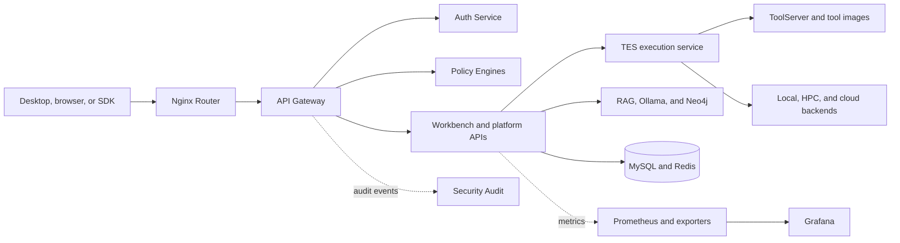

# OmniBioAI system architecture

This is the system-level map for the OmniBioAI ecosystem assembled by Studio.
Component API and implementation details belong in their owning repositories.

The root [`docker-compose.yml`](../docker-compose.yml) is the source of truth
for local development. It currently defines **41 Compose services**. This count
includes products, workers, databases, IDEs, monitoring agents, routing, and a
one-shot deployment verifier.

## System at a glance



This is a logical view. Development publishes ports for debugging; release
deployments use Nginx and the API gateway as primary entry points.

## Primary flows

### Interactive requests

1. A client reaches Nginx and API traffic passes through the API gateway.
2. Auth validates identity; policy services evaluate access and compute quota.
3. The gateway sends an authorized request to the target service.
4. Security events are delivered to audit without blocking the request.

### Workflow execution

1. Workbench or a client submits work to TES.
2. TES resolves tools through ToolServer and the tool catalog.
3. Policy services authorize resources.
4. TES selects a local, container, HPC, or cloud backend.
5. Results return to Workbench; metrics and audit events go to control services.

### AI-assisted analysis

Workbench uses RAG for scientific retrieval, Neo4j for graph relationships, and
Ollama for local model inference when local AI is enabled.

## Complete service catalog

These are the exact Compose keys, grouped by responsibility.

### Foundation and startup (3)

| Service | Responsibility |
|---|---|
| `mysql` | Shared relational persistence |
| `redis` | Cache, queues, usage data, and event streams |
| `deploy-verify` | One-shot image and source freshness validation |

### Execution and applications (12)

| Service | Responsibility |
|---|---|
| `toolserver` | Tool discovery and HTTP tool execution |
| `tes` | Task execution and backend coordination |
| `model-registry` | Model artifacts and versions |
| `billing-service` | Billing, subscriptions, and entitlements |
| `billing-worker` | Background billing and usage processing |
| `lims` | Laboratory information management |
| `rag` | Scientific retrieval-augmented generation |
| `workbench` | Main Django workbench and plugin platform |
| `celery-worker` | Workbench background tasks |
| `workflow-bundles` | Workflow bundle catalog |
| `tool-images` | Container and SIF image catalog |
| `videos` | Tutorial content service |

### Platform UI and development (8)

| Service | Responsibility |
|---|---|
| `control-center` | Health, inventory, coverage, and admin API |
| `control-center-web` | Control Center web frontend |
| `dev-hub` | Developer knowledge graph and embeddings |
| `launcher` | Studio launcher and IDE lifecycle API |
| `jupyter` | Managed JupyterLab |
| `rstudio` | Managed RStudio Server |
| `vscode` | Managed browser-based VS Code |
| `web-ui` | Static Studio web application |

### Identity, policy, audit, and licensing (10)

| Service | Responsibility |
|---|---|
| `opa` | Open Policy Agent runtime |
| `auth-service` | Authentication, tokens, and identity |
| `interaction-worker` | Asynchronous interaction processing |
| `policy-engine` | RBAC and ABAC decisions |
| `hpc-policy-engine` | Compute quota and HPC policy |
| `security-audit` | Audit ingestion and query API |
| `security-audit-worker` | Audit-event persistence |
| `api-gateway` | Authenticated external API entry point |
| `license-server` | Legacy validator; see root README known issues |
| `docker-socket-proxy` | Policy-enforcing proxy in front of the real host docker.sock for `workbench` (#265) |

### AI and graph infrastructure (2)

| Service | Responsibility |
|---|---|
| `ollama` | Local model inference |
| `neo4j` | Knowledge-graph persistence |

### Observability and routing (6)

| Service | Responsibility |
|---|---|
| `prometheus` | Metrics collection and storage |
| `grafana` | Metrics dashboards |
| `cadvisor` | Container resource metrics |
| `redis-exporter` | Redis metrics |
| `node-exporter` | Host metrics |
| `nginx-router` | Browser-facing reverse proxy |

## Deployment topologies

| Topology | Intended use | Entry point |
|---|---|---|
| Beta Cloud | Hosted use without local Docker | `webstudio.omnibioai.org` |
| Local development | Builds, debugging, direct access | Published Compose ports |
| Packaged release | Desktop-managed release images | Studio and Nginx |
| HPC or cloud execution | Remote compute selected by TES | Same client/API plane |

Do not infer production exposure from development Compose. See
[`SECURITY-COMPOSE-HARDENING.md`](../SECURITY-COMPOSE-HARDENING.md).

## Ownership and maintenance

`omnibioai-studio` owns orchestration, presentation, packaging, and integrated
topology. Domain services live in sibling repositories.

- Update development and release Compose files when topology changes.
- Update this catalog when a service changes name, ownership, or purpose.
- Keep endpoint and implementation detail in the owning repository.
- Update integration tests when cross-service contracts change.

## Operating checks

Start with the [root quick start](../README.md#-quick-start).

```bash
docker compose config --services
npm run check-docs
docker compose ps
docker compose logs --tail=200 <service>
```

The first command should list 41 services. `npm run check-docs` fails when the
catalog and Compose differ. Use `docker compose ps` for runtime state and health.
